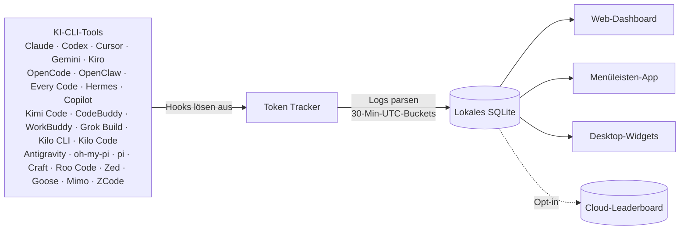

<div align="center">

# Token Tracker

[English](./README.md) · [简体中文](./README.zh-CN.md) · [日本語](./README.ja.md) · [한국어](./README.ko.md) · **Deutsch**

### Sieh genau, was du für KI ausgibst – über jedes CLI hinweg

Sammle automatisch Token-Zahlen von **25 KI-Coding-Tools**, aggregiere sie lokal und sieh echte Kostentrends in einem schönen Dashboard. Kein Cloud-Konto, keine API-Keys, kein Setup – nur ein Befehl.

[](https://www.npmjs.com/package/tokentracker-cli)
[](https://www.npmjs.com/package/tokentracker-cli)
[](https://github.com/mm7894215/homebrew-tokentracker)
[](https://opensource.org/licenses/MIT)
[](https://www.npmjs.com/package/tokentracker-cli)
[](https://github.com/mm7894215/TokenTracker/releases/latest)
[](https://github.com/mm7894215/TokenTracker/releases/latest)
[](https://github.com/mm7894215/TokenTracker/stargazers)
[](https://github.com/ruanyf/weekly/blob/master/docs/issue-393.md)
[](https://github.com/mm7894215/TokenTracker)

<br/>

<video src="https://github.com/user-attachments/assets/3275979d-bbed-4639-83e2-8b7d83bed6af" controls muted playsinline poster="https://raw.githubusercontent.com/mm7894215/tokentracker/main/docs/screenshots/dashboard-dark.png" width="820">
  
</video>

<br/><br/>

⭐ **Wenn TokenTracker dir Zeit spart, [gib ihm einen Star auf GitHub](https://github.com/mm7894215/TokenTracker) – das hilft anderen Entwicklern, es zu finden.**

<br/>

[](https://ko-fi.com/M4M11XSNWD)

</div>

---

## ⚡ Schnellstart

> **Voraussetzungen**: Node.js **20+** (CLI läuft auf macOS / Linux / Windows; native Desktop-Apps gibt es für macOS (Menüleiste) und Windows (System Tray). Cursor-Token nutzt das systemeigene `sqlite3` CLI, wo verfügbar, und nutzt `node:sqlite` als Fallback auf unterstützten Node-Versionen).

```bash
npx tokentracker-cli
```

Das war's. Beim ersten Start werden Hooks installiert, deine Daten synchronisiert und das Dashboard unter `http://localhost:7680` geöffnet.

**Das bekommst du in 30 Sekunden:**

- 📊 Ein lokales Dashboard auf `localhost:7680` mit Nutzungstrends, Modellaufschlüsselung, Kostenanalyse
- 🔌 Auto-erkannte Hooks für jedes installierte KI-Tool
- 🏠 100 % lokal – kein Konto, keine API-Keys, keine Netzwerkaufrufe (außer optionalem Leaderboard)
- 🧩 *Optional:* Ein Skills-Tab zum Durchsuchen von 250+ öffentlichen Skills – synchronisiert über Claude · Codex · Grok · Antigravity · Gemini · OpenCode · Hermes

> **Möchtest du eine native Desktop-App?**
> - **macOS** — [Lade `TokenTrackerBar.dmg` herunter](https://github.com/mm7894215/TokenTracker/releases/latest/download/TokenTrackerBar.dmg) → in Programme ziehen. Menüleisten-Symbol, Desktop-Widgets und das Dashboard in einer WKWebView.
> - **Windows** — [Lade `TokenTracker-Setup.exe` herunter](https://github.com/mm7894215/TokenTracker/releases/latest/download/TokenTracker-Setup.exe) → per-user Installer ausführen (kein Admin nötig). System-Tray-App mit Dashboard in WebView2. Portables Zip gibt's auf der [Releases-Seite](https://github.com/mm7894215/TokenTracker/releases/latest).

Für kürzere Befehle global installieren:

```bash
npm i -g tokentracker-cli

tokentracker              # Dashboard öffnen
tokentracker sync         # Manuelle Synchronisation
tokentracker status       # Hook-Status prüfen
tokentracker status --json     # Maschinenlesbare Ausgabe (für jq, AI-Agenten)
tokentracker status --light    # Reine ASCII-Tabelle (CI / SSH, kein Spinner)
tokentracker doctor       # Health Check
```

### 🍺 Homebrew (macOS)

```bash
# macOS Menüleisten-App (DMG)
brew install --cask mm7894215/tokentracker/tokentracker

# Nur CLI
brew install mm7894215/tokentracker/tokentracker
```

Aktualisieren mit `brew upgrade --cask mm7894215/tokentracker/tokentracker`. Der Tap wird innerhalb einer Stunde nach jedem Release automatisch aktualisiert.

---

## ✨ Features

- 🔌 **25 KI-Tools out of the box** — Claude Code, Codex CLI, Cursor, Gemini CLI, Antigravity, Kiro, OpenCode, OpenClaw, Every Code, Hermes Agent, GitHub Copilot, Kimi Code, CodeBuddy, WorkBuddy, Grok Build, oh-my-pi, pi, Craft Agents, Kilo CLI, Kilo Code, Roo Code, Zed Agent, Goose, Mimo Code, ZCode
- 🏠 **100 % lokal** — Token-Daten verlassen nie deinen Rechner. Kein Konto, keine API-Keys.
- 🚀 **Zero Config** — Hooks installieren sich beim ersten Start automatisch. Von null zum Dashboard in 30 Sekunden.
- 📊 **Schönes Dashboard** — Nutzungstrends, Kostenaufschlüsselung nach Modell, GitHub-ähnliche Aktivitäts-Heatmap, Projektzuordnung
- 🖥️ **Native Desktop-App** — macOS Menüleiste (+ Widgets) und Windows System Tray, jeweils mit eingebautem Server und Dashboard in einer nativen WebView
- 🎨 **4 Desktop-Widgets** — Nutzung / Aktivitäts-Heatmap / Top-Modelle / Nutzungslimits auf dem Schreibtisch
- 📈 **Echtzeit-Rate-Limit-Tracking** — Claude / Codex / Cursor / Gemini / Kiro / Copilot / Antigravity mit Reset-Countdowns
- 💰 **Kosten-Engine** — 2.200+ Modelle bepreist via [LiteLLM](https://github.com/BerriAI/litellm/blob/main/model_prices_and_context_window.json) (täglich aktualisiert) + kuratierte Overrides für Nischen-Tools; 24h-Disk-Cache + Offline-Snapshot für genaue USD-Angaben ohne Internetverbindung. Modelle ohne veröffentlichte Preise (z. B. Tencent hy3-preview) werden nach Token erfasst, zeigen aber 0 $ Kosten bis der Anbieter einen Preis veröffentlicht.
- 🌐 **Optionales Leaderboard** — Vergleiche dich mit Entwicklern weltweit; Spalten per Drag-and-Drop neu anordnen (Opt-in, Anmeldung erforderlich)
- 🧩 **Optionaler Skills-Tab** — 250+ öffentliche Skills von `anthropics/skills`, `ComposioHQ/awesome-claude-skills`, `skills.sh` und jedem GitHub-Repo durchsuchen; mit einem Klick über Claude / Codex / Grok / Antigravity / Gemini / OpenCode / Hermes synchronisieren
- 🔒 **Privacy-First** — Nur Token-Zahlen und Zeitstempel. Nie Prompts, Responses oder Dateiinhalte.

---

## 🖼️ Vorschau

<table>
<tr>
<td width="50%">

**Dashboard** — Nutzungstrends, Modellaufschlüsselung, Kostenanalyse


</td>
<td width="50%">

**Desktop-Widgets** — Nutzung auf dem Schreibtisch


</td>
</tr>
<tr>
<td width="50%">

**Menüleisten-App** — Animierter Clawd-Begleiter + native Panels


</td>
<td width="50%">

**Globales Leaderboard** — Vergleich mit Entwicklern weltweit


</td>
</tr>
<tr>
<td colspan="2">

**Skills-Manager** — 250+ öffentliche Skills von GitHub & `skills.sh` durchsuchen, einmal installieren, mit Claude / Codex / Grok / Antigravity / Gemini / OpenCode / Hermes synchronisieren. Ein-/Ausschalten pro Tool, Undo mit einem Klick.


</td>
</tr>
</table>

---

## 🔌 Unterstützte KI-Tools

| Tool | Erkennung | Methode |
|---|---|---|
| **Claude Code** | ✅ Auto | SessionEnd-Hook in `settings.json` |
| **Codex CLI** | ✅ Auto | TOML-Notify-Hook in `config.toml` |
| **Cursor** | ✅ Auto | API + SQLite-Auth-Token |
| **Kiro** | ✅ Auto | SQLite + JSONL hybrid |
| **Gemini CLI** | ✅ Auto | SessionEnd-Hook |
| **OpenCode** | ✅ Auto | Plugin-System + SQLite |
| **OpenClaw** | ✅ Auto | Session-Plugin |
| **Every Code** | ✅ Auto | TOML-Notify-Hook |
| **Hermes Agent** | ✅ Auto | SQLite Sessions-Tabelle (`~/.hermes/state.db`) |
| **GitHub Copilot** | ✅ Auto | OpenTelemetry-Datei-Exporter (`COPILOT_OTEL_FILE_EXPORTER_PATH`) |
| **Kimi Code** | ✅ Auto | Passiver `wire.jsonl`-Reader (`~/.kimi/sessions/**/wire.jsonl`) |
| **oh-my-pi (Pi Coding Agent)** | ✅ Auto | Passiver Reader (`~/.omp/agent/sessions/**/*.jsonl`) |
| **CodeBuddy** (Tencent) | ✅ Auto | SessionEnd-Hook in `~/.codebuddy/settings.json` (Claude-Code-Fork) |
| **WorkBuddy** (Tencent) | ✅ Auto | SessionEnd-Hook in `~/.workbuddy/settings.json` (Claude-Code-Fork) + passiver `projects/**/*.jsonl`-Scan |
| **Grok Build** (xAI) | ✅ Auto | SessionEnd-Hook + passiver `updates.jsonl` / `signals.json`-Scan (`~/.grok/sessions/**/`) |
| **Kilo CLI** (kilo.ai) | ✅ Auto | Passiver SQLite-Reader (`~/.local/share/kilo/kilo.db`, OpenCode-Fork-Schema) |
| **Kilo Code** (VS Code Extension) | ✅ Auto | Passiver `ui_messages.json`-Reader (Cursor/Code/CodeBuddy/Windsurf globalStorage) |
| **Antigravity** | ✅ Auto | Passiver Transcript-Reader (`~/.gemini/{antigravity,antigravity-ide,antigravity-cli}/brain/**/transcript.jsonl`) |
| **pi** (`@mariozechner/pi-coding-agent`) | ✅ Auto | Passiver Reader (`~/.pi/agent/sessions/**/*.jsonl`) |
| **Craft Agents** | ✅ Auto | Passiver Session-Reader (`~/.craft-agent` + Workspace-Session-Logs) |
| **Roo Code** (VS Code Extension) | ✅ Auto | Passiver `ui_messages.json`-Reader (`rooveterinaryinc.roo-cline`) |
| **Zed Agent** | ✅ Auto | Passiver SQLite-Reader (`threads.db`, nur `zed.dev`-Modelle) |
| **Goose** (Block) | ✅ Auto | Passiver SQLite-Reader (`sessions.db`, kumulative Deltas) |
| **Mimo Code** (mimocode) | ✅ Auto | Passiver SQLite-Reader (`~/.local/share/mimocode/mimocode.db`, OpenCode-Fork-Schema; zählt nur mimo-native Turns – gespiegelte Claude/claude-mem-Verläufe werden ausgeschlossen) |
| **ZCode** (Z.ai) | ✅ Auto | Passiver SQLite-Reader (`~/.zcode/cli/db/db.sqlite`, OpenCode-Fork-Schema; zählt nur Z.ai/BigModel-GLM-Turns – gebündelte Claude/Codex/Gemini-Sub-Agenten werden ausgeschlossen) |

> **Muss ich Plugins oder Hooks manuell installieren?** Nein. `tokentracker` (oder `tokentracker init`) erledigt alles beim ersten Start:
> - **Hook-basiert** (Claude Code, Codex, Gemini, Every Code, CodeBuddy, WorkBuddy, Grok Build) — wir schreiben einen SessionEnd-Hook oder TOML-Notify-Eintrag in die Konfiguration des Tools.
> - **Plugin-basiert** (OpenCode, OpenClaw) — das Plugin ist im npm-Paket enthalten (`~/.tokentracker/app/openclaw-plugin/`). Wir verlinken es per CLI (`openclaw plugins install --link …` + `enable`). Kein Download, kein Drag-and-Drop.
> - **Passive Reader** (Cursor, Kiro, Hermes, Kimi Code, Copilot, Grok Build, oh-my-pi, pi, Craft Agents, Kilo CLI, Kilo Code, Roo Code, Antigravity, Zed Agent, Goose, Mimo Code, ZCode) — wir installieren nichts in diesen Tools. Wir lesen nur Dateien, die sie bereits produzieren (SQLite-DB, JSONL, OTEL-Export, Session-Logs).
>
> Führe `tokentracker status` aus, um den Status jeder Integration zu prüfen. Zeigt ein Tool `skipped`, erklärt die `detail`-Spalte warum.
>
> Tiefergehend: [OpenClaw-Integration & Troubleshooting](docs/openclaw-integration.md).

Fehlt dein Tool? [Erstelle ein Issue](https://github.com/mm7894215/TokenTracker/issues/new) — neue Provider sind meist nur eine Parser-Datei entfernt.

---

## 🆚 Warum TokenTracker?

> **Suchst du eine ccusage-Alternative mit GUI?** TokenTracker unterstützt 25 Tools (nicht nur Claude Code), bietet eine native macOS-Menüleisten-App + Desktop-Widgets und dedupliziert Token-Datensätze korrekt über alle Provider hinweg – damit deine Zahlen mit dem Billing der Provider übereinstimmen.

| | **TokenTracker** | ccusage | Cursor Stats |
|---|---|---|---|
| **Unterstützte KI-Tools** | **25** | 1 (Claude) | 1 (Cursor) |
| **Lokal, kein Konto** | ✅ | ✅ | ❌ |
| **Native Desktop-App** | ✅ macOS + Windows | ❌ | ❌ |
| **Desktop-Widgets** | ✅ 4 Widgets | ❌ | ❌ |
| **Rate-Limit-Tracking** | ✅ 7 Provider | ❌ | Nur Cursor |
| **Präzises Multi-Provider-Dedup** | ✅ | ❌ ¹ | — |

<sub>¹ `reqId`-basierte Deduplizierung zählt Provider ohne Request-ID (DeepSeek / Kimi / MiniMax / Claude-Sub-Agenten) 1,6–3,7× über. TokenTracker dedupliziert über einen zusammengesetzten Schlüssel, sodass die Summen mit dem Billing der jeweiligen Provider übereinstimmen.</sub>

---

## 🏗️ Wie es funktioniert



1. KI-CLI-Tools erzeugen Logs während der normalen Nutzung
2. Leichtgewichtige Hooks erkennen Änderungen und lösen Sync aus (Cursor nutzt API statt Hooks)
3. Token-Zahlen werden lokal geparst – nie Prompt- oder Response-Inhalte
4. In 30-Minuten-UTC-Buckets aggregiert
5. Dashboard, Menüleisten-App und Widgets lesen vom gleichen lokalen Snapshot

---

## 🛡️ Datenschutz

| Schutz | Beschreibung |
|---|---|
| **Kein Content-Upload** | Nur Token-Zahlen und Zeitstempel. Nie Prompts, Responses oder Dateiinhalte. |
| **Standardmäßig lokal** | Alle Daten bleiben auf deinem Rechner. Das Leaderboard ist vollständig optional. |
| **Überprüfbar** | Open Source. Sieh selbst in [`src/lib/rollout.js`](src/lib/rollout.js) – nur Zahlen und Zeitstempel. |
| **Nur anonymer Heartbeat** | Um aktive Installationen zu zählen, sendet die App höchstens einen anonymen Ping pro Tag: ein Einweg-Hash der Maschinen-ID, App-Version, OS-Plattform und App-Shell (cli/mac/win). Niemals Token-Zahlen, Modellnamen, Prompts oder Pfade. Auditierbar in [`src/lib/telemetry.js`](src/lib/telemetry.js); Deaktivierung über `TOKENTRACKER_NO_TELEMETRY=1` oder `DO_NOT_TRACK=1`. |

---

## 📦 Konfiguration

Die meisten Nutzer brauchen das nie – die Standardwerte sind sinnvoll. Für fortgeschrittene Setups:

| Variable | Beschreibung | Standard |
|---|---|---|
| `TOKENTRACKER_DEBUG` | Debug-Ausgabe aktivieren (`1` zum Aktivieren) | — |
| `TOKENTRACKER_NO_TELEMETRY` | Anonymen täglichen Heartbeat deaktivieren (`1` zum Deaktivieren; der `DO_NOT_TRACK`-Standard wird ebenfalls respektiert) | — |
| `TOKENTRACKER_HTTP_TIMEOUT_MS` | HTTP-Timeout in Millisekunden | `20000` |
| `CODEX_HOME` | Codex CLI-Verzeichnis überschreiben | `~/.codex` |
| `GEMINI_HOME` | Gemini CLI-Verzeichnis überschreiben | `~/.gemini` |
| `TOKENTRACKER_GROK_HOME` | Grok Build-Verzeichnis für Grok-Integration und Skills-Manager | `~/.grok` |
| `GROK_HOME` | Legacy-Grok-Build-Verzeichnis, falls `TOKENTRACKER_GROK_HOME` nicht gesetzt | `~/.grok` |
| `TOKENTRACKER_ANTIGRAVITY_HOME` | Einzelnes Antigravity-Skills-Verzeichnis erzwingen (sonst Auto-Erkennung von `~/.gemini/antigravity` + `~/.gemini/antigravity-ide`) | auto |

---

## 🛠️ Entwicklung

```bash
git clone https://github.com/mm7894215/TokenTracker.git
cd TokenTracker
npm install

# Dashboard bauen + CLI ausführen
cd dashboard && npm install && npm run build && cd ..
node bin/tracker.js

# Tests
npm test
```

### macOS-App bauen

```bash
cd TokenTrackerBar
npm run dashboard:build              # Dashboard-Bundle bauen
./scripts/bundle-node.sh             # Node.js + tokentracker-Quellen bündeln
xcodegen generate                    # Xcode-Projekt generieren
ruby scripts/patch-pbxproj-icon.rb   # Icon-Composer-Asset einspielen
xcodebuild -scheme TokenTrackerBar -configuration Release clean build
./scripts/create-dmg.sh              # .app in DMG verpacken
```

Erfordert **Xcode 16+** und [XcodeGen](https://github.com/yonaskolb/XcodeGen).

---

## 🔧 Fehlerbehebung

### CLI

<details>
<summary><b>Fehler „engines.node" oder nicht unterstützte Node-Version</b></summary>

<br/>

TokenTracker benötigt **Node 20+**. Prüfe deine Version:

```bash
node --version
```

Falls niedriger, aktualisiere via [nvm](https://github.com/nvm-sh/nvm), [fnm](https://github.com/Schniz/fnm) oder deinem Paketmanager (`brew upgrade node`, `apt install nodejs`).

</details>

<details>
<summary><b>Port 7680 bereits belegt</b></summary>

<br/>

Der Dashboard-Server wählt automatisch den nächsten freien Port (`7681`, `7682`, …), wenn `7680` belegt ist. Der tatsächliche Port wird beim Start ausgegeben. Um einen bestimmten Port zu erzwingen:

```bash
PORT=7700 tokentracker serve
```

Herausfinden, was `7680` blockiert:

```bash
lsof -i :7680
```

</details>

<details>
<summary><b>Ein Provider wird nicht erkannt</b></summary>

<br/>

Integrationsstatus prüfen:

```bash
tokentracker status
```

Für einen tiefergehenden Health Check:

```bash
tokentracker doctor
```

Zeigt ein Provider `not configured`, obwohl du ihn nutzt, versuche `tokentracker activate-if-needed`. Falls immer noch fehlend, [erstelle ein Issue](https://github.com/mm7894215/TokenTracker/issues/new) mit der `doctor`-Ausgabe.

</details>

<details>
<summary><b>Hooks deinstallieren und Konfiguration löschen</b></summary>

<br/>

```bash
tokentracker uninstall
```

Entfernt alle von TokenTracker installierten Hooks sowie die lokale Konfiguration und Daten. Kann bedenkenlos wiederholt werden.

</details>

### macOS-App

<details>
<summary><b>„TokenTrackerBar kann nicht geöffnet werden" – nicht verifizierter Entwickler</b></summary>

<br/>

TokenTrackerBar ist **ad-hoc signiert** (nicht notariell beglaubigt mit einer Apple Developer ID – das erfordert ein kostenpflichtiges Developer-Konto). Gatekeeper blockiert sie beim ersten Start.

1. **Systemeinstellungen → Datenschutz & Sicherheit** öffnen
2. Zum Bereich **Sicherheit** scrollen – dort steht *„TokenTrackerBar wurde blockiert, um deinen Mac zu schützen."*
3. **Trotzdem öffnen** klicken
4. Mit **Öffnen** im Folgedialog bestätigen (Authentifizierung erforderlich)

Nur einmal nötig. Alternative unter älterem macOS: Rechtsklick auf die App im Finder → **Öffnen** → **Öffnen** im Bestätigungsdialog.

</details>

<details>
<summary><b>„TokenTrackerBar ist beschädigt und kann nicht geöffnet werden"</b></summary>

<br/>

Das ist Gatekeeper, das auf das `com.apple.quarantine`-Attribut reagiert – kein echtes Problem. Einmalig beheben mit:

```bash
xattr -cr /Applications/TokenTrackerBar.app
```

Danach öffnet die App normal.

</details>

<details>
<summary><b>„TokenTrackerBar möchte auf Daten anderer Apps zugreifen"</b></summary>

<br/>

Das wird für die **Cursor**- und **Kiro**-Integration benötigt. Sie speichern Auth-Tokens / Nutzungsdaten in eigenen `~/Library/Application Support/`-Ordnern, die macOS mit der App-Management-Berechtigung schützt.

- ✅ **Erlauben** klicken, wenn du Cursor oder Kiro nutzt
- ❌ **Nicht erlauben** klicken, wenn nicht – diese Provider werden übersprungen, alles andere funktioniert

Nach einmaliger Gewährung wird die Berechtigung gemerkt. Ad-hoc-signierte Builds fragen nach jedem Update erneut, da jeder Build eine neue Signatur hat.

</details>

---

## 🪪 README-Badges

Zeig deine Token-Nutzung auf deinem GitHub-Profil oder in deiner Projekt-README.

So findest du `DEINE_USER_ID`:
1. Führe `tokentracker` aus, öffne das Dashboard und melde dich beim Leaderboard an.
2. Gehe zu **Einstellungen → Konto**.
3. Nutze die dort angezeigte **User ID**. Auf Headless-Maschinen schreibt `tokentracker device-login` die `user_id` ebenfalls nach `~/.tokentracker/tracker/config.json`.

Dann füge eines davon ein:

```markdown
[](https://github.com/mm7894215/TokenTracker)
[](https://github.com/mm7894215/TokenTracker)
[](https://github.com/mm7894215/TokenTracker)
```

> Der Link verweist standardmäßig auf das TokenTracker-Repo, damit jeder Klick anderen Entwicklern hilft, das Tool zu entdecken. Du kannst ihn gegen dein Leaderboard-Profil, deine Website oder `https://www.tokentracker.cc` austauschen.

Shields.io-kompatible Badges mit deinen aktuellen Gesamtwerten (60s Cache):

| Parameter | Werte | Standard |
|---|---|---|
| `metric` | `tokens` / `cost` / `rank` | `tokens` |
| `period` | `week` / `month` / `total` | `total` |
| `style` | `flat` / `flat-square` | `flat` |
| `label` | beliebiger kurzer Text | Metrik-Name |
| `color` | hex, z. B. `ff6b35` | Marken-Grün |

> **Datenschutz**: Badges werden nur für Profile aufgelöst, bei denen das Leaderboard-Sharing **aktiv** ist (`Einstellungen → Konto → Öffentliches Profil`). Private Profile zeigen einen „private"-Platzhalter.

---

## ⭐ Stern-Verlauf

<a href="https://star-history.com/#mm7894215/TokenTracker&Date">
  
</a>

---

## 🤝 Beitragen & Support

- **Bugs / Feature-Wünsche**: [Issue erstellen](https://github.com/mm7894215/TokenTracker/issues/new)
- **Sicherheit**: Siehe [SECURITY.md](SECURITY.md) – bitte keine öffentlichen Issues für Sicherheitsmeldungen
- **Pull Requests**: Siehe [CONTRIBUTING.md](CONTRIBUTING.md) für Setup, Tests und das Hinzufügen neuer KI-Tool-Integrationen
- **Fragen / Vorstellungen**: [GitHub Discussions](https://github.com/mm7894215/TokenTracker/discussions)

## 🙏 Danksagungen

Das Clawd-Charakterdesign gehört Anthropic. Dies ist ein Community-Projekt ohne offizielle Verbindung zu Anthropic.

## 🔗 Links

- [LINUX DO](https://linux.do) — eine Entwickler-Community

## Lizenz

[MIT](LICENSE)

---

<div align="center">

**Token Tracker** – Quantifiziere deine KI-Ausgaben.

<a href="https://www.tokentracker.cc">tokentracker.cc</a>  ·  <a href="https://www.npmjs.com/package/tokentracker-cli">npm</a>  ·  <a href="https://github.com/mm7894215/TokenTracker">GitHub</a>

</div>
