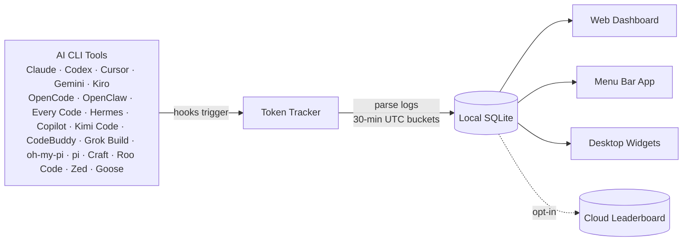

 <div align="center">

# Token Tracker

[English](./README.md) · [简体中文](./README.zh-CN.md) · **日本語** · [한국어](./README.ko.md)

### AI に使ったコストを正確に把握 — すべての CLI を横断して

**22 種類の AI コーディングツール**からトークン数を自動収集し、ローカルで集計、美しいダッシュボードで本当のコスト推移を可視化します。クラウドアカウント不要、API キー不要、セットアップ不要 — コマンド 1 つで完了です。

[](https://www.npmjs.com/package/tokentracker-cli)
[](https://www.npmjs.com/package/tokentracker-cli)
[](https://github.com/mm7894215/homebrew-tokentracker)
[](https://opensource.org/licenses/MIT)
[](https://www.apple.com/macos/)
[](https://github.com/mm7894215/TokenTracker/stargazers)
[](https://github.com/mm7894215/TokenTracker)

<br/>


<br/><br/>

⭐ **TokenTracker が時間の節約に役立ったら、ぜひ [GitHub でスターを付けてください](https://github.com/mm7894215/TokenTracker) — 他の開発者が見つけやすくなります。**

<br/>

[](https://ko-fi.com/M4M11XSNWD)

</div>

---

## ⚡ クイックスタート

> **動作要件**: Node.js **20+**（CLI は macOS / Linux / Windows で動作します。メニューバーアプリは macOS 専用です。Cursor のトークン読み取りは、利用可能であればシステムの `sqlite3` CLI を使用し、対応する Node リリースでは `node:sqlite` にフォールバックします）。

```bash
npx tokentracker-cli
```

これだけです。初回実行で hook をインストールし、データを同期して、`http://localhost:7680` でダッシュボードを開きます。

**30 秒で手に入るもの:**
- 📊 `localhost:7680` のローカルダッシュボードで、使用トレンド、モデル別内訳、コスト分析が見える
- 🔌 インストール済みの対応 AI ツールすべてに対する hook を自動検出
- 🏠 100% ローカル — アカウント不要、API キー不要、ネットワーク通信なし（オプションのリーダーボードを除く）
- 🧩 *オプション:* 250+ の公開 Skill を閲覧して Claude · Codex · Gemini · OpenCode · Hermes 間で同期できる Skills タブ

> **ネイティブの macOS メニューバーアプリが欲しい?** [`TokenTrackerBar.dmg` をダウンロード](https://github.com/mm7894215/TokenTracker/releases/latest) → Applications にドラッグ。デスクトップウィジェット、メニューバーのステータスアイコン、そして WKWebView 上の同じダッシュボードを含みます。

短いコマンドで使うためグローバルインストール:

```bash
npm i -g tokentracker-cli

tokentracker              # ダッシュボードを開く
tokentracker sync         # 手動同期
tokentracker status       # hook の状態を確認
tokentracker doctor       # ヘルスチェック
```

### 🍺 Homebrew (macOS)

`brew` 派なら、追加の tap 操作なしで直接インストールできます:

```bash
# macOS メニューバーアプリ (DMG)
brew install --cask mm7894215/tokentracker/tokentracker

# CLI のみ
brew install mm7894215/tokentracker/tokentracker
```

アップグレードは `brew upgrade --cask mm7894215/tokentracker/tokentracker`。tap は新リリースから 1 時間以内に自動更新されます。

---


## ✨ 機能

- 🔌 **22 種類の AI ツールを標準対応** — Claude Code、Codex CLI、Cursor、Gemini CLI、Antigravity、Kiro、OpenCode、OpenClaw、Every Code、Hermes Agent、GitHub Copilot、Kimi Code、CodeBuddy、Grok Build、oh-my-pi、pi、Craft Agents、Kilo CLI、Kilo Code、Roo Code、Zed Agent、Goose
- 🏠 **100% ローカル** — トークンデータがマシンから外に出ることはありません。アカウント不要、API キー不要。
- 🚀 **ゼロコンフィグ** — Hook は初回実行で自動インストール。0 からダッシュボードまで 30 秒。
- 📊 **美しいダッシュボード** — 使用トレンド、モデル別コスト内訳、GitHub スタイルのアクティビティヒートマップ、プロジェクト別の帰属表示
- 🖥️ **ネイティブ macOS アプリ** — メニューバーのステータスアイコン、組み込みサーバー、WKWebView ダッシュボード
- 🎨 **4 種類のデスクトップウィジェット** — Pin Usage / Activity Heatmap / Top Models / Usage Limits をデスクトップに固定
- 📈 **リアルタイムのレート制限トラッキング** — Claude / Codex / Cursor / Gemini / Kiro / Copilot / Antigravity のクォータウィンドウとリセットまでのカウントダウン
- 💰 **コストエンジン** — [LiteLLM](https://github.com/BerriAI/litellm/blob/main/model_prices_and_context_window.json) 経由で 2,200+ モデルの価格設定（毎日自動更新）に加え、ニッチなツール（Kiro、Cursor Composer、Kimi、CodeBuddy hy3）向けに厳選された上書き設定。24 時間のディスクキャッシュ + 同梱のオフラインスナップショットにより、ネット接続なしでも正確な USD 表示が可能です。ベンダーが公式価格を公開していないモデル（例: Tencent hy3-preview）はトークン数のみ追跡され、ベンダーが料金を公開するまでコストは $0 と表示されます。
- 🌐 **オプションのリーダーボード** — 世界中の開発者と比較。ドラッグで列を並び替えて、気になるプロバイダーに絞り込めます（オプトイン制、参加にはサインインが必要）
- 🧩 **オプションの Skills タブ** — `anthropics/skills`、`ComposioHQ/awesome-claude-skills`、`skills.sh`、そして自分で追加した任意の GitHub リポジトリから 250+ の公開 Skill をブラウズ。Claude / Codex / Gemini / OpenCode / Hermes にターゲット名を付けて同期し、ワンクリックで Undo
- 🔒 **プライバシー最優先** — トークン数とタイムスタンプのみ。プロンプト、レスポンス、ファイル内容を扱うことは一切ありません。

---

## 🖼️ ショーケース

<table>
<tr>
<td width="50%">

**ダッシュボード** — 使用トレンド、モデル別内訳、コスト分析


</td>
<td width="50%">

**デスクトップウィジェット** — 使用状況をデスクトップに固定


</td>
</tr>
<tr>
<td width="50%">

**メニューバーアプリ** — アニメーション付きの Clawd コンパニオン + ネイティブパネル


</td>
<td width="50%">

**グローバルリーダーボード** — 世界中の開発者と比較


</td>
</tr>
<tr>
<td colspan="2">

**Skills Manager** — GitHub と `skills.sh` から 250+ の公開 Skill をブラウズし、一度インストールするだけで Claude / Codex / Gemini / OpenCode / Hermes に同期。ターゲットごとのトグル、ワンクリック Undo、ファイルの手動コピー不要。


</td>
</tr>
</table>

---

## 🔌 対応 AI ツール

| ツール | 検出 | 方式 |
|---|---|---|
| **Claude Code** | ✅ 自動 | `settings.json` 内の SessionEnd hook |
| **Codex CLI** | ✅ 自動 | `config.toml` 内の TOML notify hook |
| **Cursor** | ✅ 自動 | API + SQLite の認証トークン |
| **Kiro** | ✅ 自動 | SQLite + JSONL のハイブリッド |
| **Gemini CLI** | ✅ 自動 | SessionEnd hook |
| **OpenCode** | ✅ 自動 | プラグインシステム + SQLite |
| **OpenClaw** | ✅ 自動 | セッションプラグイン |
| **Every Code** | ✅ 自動 | TOML notify hook |
| **Hermes Agent** | ✅ 自動 | SQLite の sessions テーブル (`~/.hermes/state.db`) |
| **GitHub Copilot** | ✅ 自動 | OpenTelemetry のファイルエクスポーター (`COPILOT_OTEL_FILE_EXPORTER_PATH`) |
| **Kimi Code** | ✅ 自動 | パッシブな `wire.jsonl` リーダー (`~/.kimi/sessions/**/wire.jsonl`) |
| **oh-my-pi (Pi Coding Agent)** | ✅ 自動 | パッシブリーダー (`~/.omp/agent/sessions/**/*.jsonl`) |
| **CodeBuddy** (Tencent) | ✅ 自動 | `~/.codebuddy/settings.json` 内の SessionEnd hook（Claude-Code fork） |
| **Grok Build** (xAI) | ✅ 自動 | SessionEnd hook + パッシブな `updates.jsonl` / `signals.json` スキャン (`~/.grok/sessions/**/`) |
| **Kilo CLI** (kilo.ai) | ✅ 自動 | パッシブな SQLite リーダー (`~/.local/share/kilo/kilo.db`、OpenCode-fork スキーマ) |
| **Kilo Code** (VS Code 拡張) | ✅ 自動 | パッシブな `ui_messages.json` リーダー (Cursor/Code/CodeBuddy/Windsurf の globalStorage) |
| **Antigravity** | ✅ 自動 | パッシブなトランスクリプトリーダー (`~/.gemini/{antigravity,antigravity-ide,antigravity-cli}/brain/**/transcript.jsonl`) |
| **pi** (`@mariozechner/pi-coding-agent`) | ✅ 自動 | パッシブリーダー (`~/.pi/agent/sessions/**/*.jsonl`) |
| **Craft Agents** | ✅ 自動 | パッシブなセッションリーダー (`~/.craft-agent` + workspace session logs) |
| **Roo Code** (VS Code 拡張) | ✅ 自動 | パッシブな `ui_messages.json` リーダー (`rooveterinaryinc.roo-cline`) |
| **Zed Agent** | ✅ 自動 | パッシブな SQLite リーダー (`threads.db`、hosted `zed.dev` models only) |
| **Goose** (Block) | ✅ 自動 | パッシブな SQLite リーダー (`sessions.db`、cumulative deltas) |

> **プラグインや hook を手動でインストールする必要はありますか?** いいえ。`tokentracker`（または `tokentracker init`）が初回実行ですべて処理します:
> - **Hook ベース**のツール (Claude Code、Codex、Gemini、Every Code、**CodeBuddy**、**Grok Build**) — ツール自身の設定に SessionEnd hook または TOML notify エントリーを書き込みます。
> - **プラグインベース**のツール (OpenCode、**OpenClaw**) — プラグインは npm パッケージ内に同梱されています (`~/.tokentracker/app/openclaw-plugin/`)。ツール自身の CLI でリンクします (`openclaw plugins install --link …` + `enable`)。ダウンロードもドラッグ＆ドロップも不要です。
> - **パッシブリーダー** (Cursor、Kiro、Hermes、Kimi Code、Copilot、**Grok Build**、**oh-my-pi**、**pi**、**Craft Agents**、**Kilo CLI**、**Kilo Code**、**Roo Code**、**Antigravity**、**Zed Agent**、**Goose**) — これらのツールには何もインストールしません。ツールがすでに出力しているファイル (SQLite DB、JSONL、OTEL エクスポート、session logs) を読むだけです。
> - **Grok Build の推定** — 現在のローカルテレメトリは `updates.jsonl` の累積 `totalTokens` を公開していますが、安定したプロンプト/出力/キャッシュの内訳はありません。`signals.json` は `contextTokensUsed` のスナップショットを使ったフォールバックとして残っています。コールごとの利用詳細が利用可能になるまで、TokenTracker は Grok のコストを推定します。
>
> いつでも `tokentracker status` を実行すれば、各統合の状態を確認できます。`skipped` と表示されている場合、`detail` 列にその理由が示されます（例: ツール CLI が `PATH` にない、設定が読めない）。
>
> もっと深く知りたい方へ: [OpenClaw 統合とトラブルシューティング](docs/openclaw-integration.md)。

お使いのツールが見当たらない? [Issue を立ててください](https://github.com/mm7894215/TokenTracker/issues/new) — 新しいプロバイダーの追加は、たいていパーサーファイル 1 つで済みます。

---

## 🆚 なぜ TokenTracker?

|                          | **TokenTracker** | ccusage     | Cursor stats |
|--------------------------|:---:|:---:|:---:|
| **対応 AI ツール数**     | **22**           | 1 (Claude)  | 1 (Cursor)   |
| **ローカルファースト、アカウント不要** | ✅            | ✅           | ❌            |
| **ネイティブメニューバーアプリ** | ✅                | ❌           | ❌            |
| **デスクトップウィジェット** | ✅ 4 種類      | ❌           | ❌            |
| **レート制限トラッキング** | ✅ 7 プロバイダー    | ❌           | Cursor のみ  |

---

## 🏗️ 仕組み



1. AI CLI ツールが通常利用中にログを生成
2. 軽量な hook が変更を検出して同期をトリガー（Cursor は hook ではなく API を使用）
3. トークン数はローカルで解析 — プロンプトやレスポンスの内容には一切触れない
4. UTC の 30 分単位バケットに集計
5. ダッシュボード、メニューバーアプリ、ウィジェットはすべて同じローカルスナップショットから読み取る

---

## 🛡️ プライバシー

| 保護 | 説明 |
|---|---|
| **コンテンツをアップロードしない** | トークン数とタイムスタンプのみ。プロンプト、レスポンス、ファイル内容は扱いません。 |
| **デフォルトでローカル限定** | すべてのデータはマシン上に留まります。リーダーボードは完全にオプトインです。 |
| **監査可能** | オープンソース。[`src/lib/rollout.js`](src/lib/rollout.js) を読んでください — 数字とタイムスタンプだけです。 |
| **テレメトリなし** | 分析もクラッシュレポートもフォンホームもありません。 |

---

## 📦 設定

ほとんどのユーザーは触る必要がありません — デフォルトで十分に機能します。高度な設定向け:

| 変数 | 説明 | デフォルト |
|---|---|---|
| `TOKENTRACKER_DEBUG` | デバッグ出力を有効化（`1` で有効） | — |
| `TOKENTRACKER_HTTP_TIMEOUT_MS` | HTTP タイムアウト（ミリ秒） | `20000` |
| `CODEX_HOME` | Codex CLI ディレクトリの上書き | `~/.codex` |
| `GEMINI_HOME` | Gemini CLI ディレクトリの上書き | `~/.gemini` |

---

## 🛠️ 開発

```bash
git clone https://github.com/mm7894215/TokenTracker.git
cd TokenTracker
npm install

# ダッシュボードをビルドして CLI を実行
cd dashboard && npm install && npm run build && cd ..
node bin/tracker.js

# テスト
npm test
```

### macOS アプリのビルド

```bash
cd TokenTrackerBar
npm run dashboard:build              # ダッシュボードバンドルをビルド
./scripts/bundle-node.sh             # Node.js + tokentracker ソースをバンドル
xcodegen generate                    # Xcode プロジェクトを生成
ruby scripts/patch-pbxproj-icon.rb   # Icon Composer アセットをパッチ適用
xcodebuild -scheme TokenTrackerBar -configuration Release clean build
./scripts/create-dmg.sh              # .app を DMG にパッケージ化
```

**Xcode 16+** と [XcodeGen](https://github.com/yonaskolb/XcodeGen) が必要です。

---

## 🔧 トラブルシューティング

### CLI

<details>
<summary><b>「engines.node」または非対応バージョンのエラー</b></summary>

<br/>

TokenTracker は **Node 20+** を必要とします。バージョンを確認:

```bash
node --version
```

低い場合は [nvm](https://github.com/nvm-sh/nvm)、[fnm](https://github.com/Schniz/fnm)、またはパッケージマネージャー (`brew upgrade node`、`apt install nodejs`) でアップグレードしてください。

</details>

<details>
<summary><b>ポート 7680 がすでに使用中</b></summary>

<br/>

ダッシュボードサーバーは `7680` が使われている場合、自動的に次の空きポート (`7681`、`7682`、…) を選びます。実際に使われているポートは起動時にログ出力されます。特定のポートを強制したい場合:

```bash
PORT=7700 tokentracker serve
```

`7680` を掴んでいるプロセスを探すには:

```bash
lsof -i :7680
```

</details>

<details>
<summary><b>プロバイダーが検出されない</b></summary>

<br/>

統合の状態を確認:

```bash
tokentracker status
```

次に doctor でより深いヘルスチェックを実行:

```bash
tokentracker doctor
```

使っているはずなのに未設定と表示されるプロバイダーがある場合、`tokentracker activate-if-needed` で hook 検出を再実行してみてください。それでも見つからない場合は、`doctor` の出力を添えて [Issue を立ててください](https://github.com/mm7894215/TokenTracker/issues/new)。

</details>

<details>
<summary><b>hook をアンインストールして設定をすべて削除する方法</b></summary>

<br/>

```bash
tokentracker uninstall
```

これにより、検出されたすべての AI ツールに対して TokenTracker がインストールした hook を削除し、ローカルの設定とデータも消します。再実行しても安全です。

</details>

### macOS アプリ

<details>
<summary><b>「TokenTrackerBar を開けません」 — 未確認の開発元</b></summary>

<br/>

TokenTrackerBar は **アドホック署名**されています（Apple Developer ID による公証は行っていません — それには有料の Developer アカウントが必要です）。Gatekeeper が初回起動時にブロックします。

1. **システム設定 → プライバシーとセキュリティ**を開く
2. **セキュリティ** セクションまでスクロール — *「TokenTrackerBar は Mac を保護するためブロックされました。」* が表示されます
3. **このまま開く** をクリック
4. 続けて出るダイアログで **開く** を選んで確定（認証が必要です）

一度行えば OK です。古い macOS でのやり方: Finder でアプリを右クリック → **開く** → 確認ダイアログで **開く**。

</details>

<details>
<summary><b>「TokenTrackerBar は壊れているため開けません」</b></summary>

<br/>

これは macOS がダウンロードファイルに付与する `com.apple.quarantine` 属性に Gatekeeper が反応しているだけで、実際の問題ではありません。次のコマンドで一度クリアしてください:

```bash
xattr -cr /Applications/TokenTrackerBar.app
```

これでアプリは普通に開けます。

</details>

<details>
<summary><b>「TokenTrackerBar が他のアプリのデータにアクセスしようとしています」</b></summary>

<br/>

これは **Cursor** と **Kiro** 統合に必要です。これらは認証トークンや利用データを `~/Library/Application Support/` 配下の自分のフォルダーに保存しており、macOS は App Management 権限で保護しています。

- ✅ Cursor または Kiro を使っているなら **許可** をクリック
- ❌ 使っていないなら **許可しない** をクリック — それらのプロバイダーは黙ってスキップされ、それ以外はすべて動き続けます

一度許可すれば、その権限は記憶されます。アドホック署名のビルドは、アップグレードごとに署名アイデンティティが変わるため、再度プロンプトが出る点に注意してください。

</details>

---

## 🪪 README バッジ

GitHub プロフィールやプロジェクトの README で自分のトークン使用量をアピールしましょう。

`YOUR_USER_ID` の取得方法:
1. `tokentracker` を実行してダッシュボードを開き、リーダーボードにサインインします。
2. **Settings → Account** に移動します。
3. そこに表示される **User ID** を使います。headless / SSH 環境では、`tokentracker device-login` も同じ `user_id` を `~/.tokentracker/tracker/config.json` に書き込みます。

以下のどれかを貼り付けてください:

```markdown
[](https://github.com/mm7894215/TokenTracker)
[](https://github.com/mm7894215/TokenTracker)
[](https://github.com/mm7894215/TokenTracker)
```

> リンク先はデフォルトで TokenTracker リポジトリに設定してあり、クリックがそのまま他の開発者の発見につながります。あなた自身の leaderboard プロフィール、個人サイト、または `https://www.tokentracker.cc` に飛ばしたい場合は URL を差し替えてください。

現在の合計を反映した shields.io 互換バッジが描画されます（60 秒キャッシュ）:

| パラメータ | 値 | デフォルト |
|---|---|---|
| `metric` | `tokens` / `cost` / `rank` | `tokens` |
| `period` | `week` / `month` / `total` | `total` |
| `style` | `flat` / `flat-square` | `flat` |
| `label` | 任意の短い文字列 | metric 名 |
| `color` | hex（例: `ff6b35`） | ブランドグリーン |

> **プライバシー**: バッジはリーダーボード共有が **オン** (`Settings → Account → Public profile`) のプロフィールに対してのみ解決されます。非公開プロフィールには「private」プレースホルダーが返ります。

---

## ⭐ Star History

<a href="https://star-history.com/#mm7894215/TokenTracker&Date">
  
</a>

---

## 🤝 コントリビューション & サポート

- **バグ / 機能リクエスト**: [Issue を立てる](https://github.com/mm7894215/TokenTracker/issues/new)
- **セキュリティ**: [SECURITY.md](SECURITY.md) を参照 — セキュリティ報告は公開 Issue として立てないでください
- **プルリクエスト**: セットアップ、テスト、新しい AI ツール統合の追加方法は [CONTRIBUTING.md](CONTRIBUTING.md) を参照
- **質問 / ショーケース**: [GitHub Discussions](https://github.com/mm7894215/TokenTracker/discussions)

## 🙏 クレジット

Clawd キャラクターのデザインは Anthropic に帰属します。本プロジェクトはコミュニティ主導のものであり、Anthropic との公式な提携関係はありません。

## ライセンス

[MIT](LICENSE)

---

<div align="center">

**Token Tracker** — あなたの AI アウトプットを定量化する。

<a href="https://www.tokentracker.cc">tokentracker.cc</a>  ·  <a href="https://www.npmjs.com/package/tokentracker-cli">npm</a>  ·  <a href="https://github.com/mm7894215/TokenTracker">GitHub</a>

</div>
