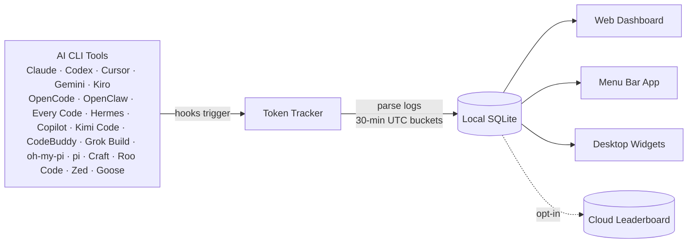

 <div align="center">

# Token Tracker

[English](./README.md) · [简体中文](./README.zh-CN.md) · [日本語](./README.ja.md) · **한국어**

### 모든 CLI에서 AI에 쓰는 비용을 정확히 파악

**22개의 AI 코딩 도구**에서 토큰 수치를 자동으로 수집하고 로컬에서 집계해, 실제 비용 추세를 아름다운 대시보드에서 확인. 클라우드 계정 불필요, API Key 불필요, 셋업 불필요 — 명령 한 줄이면 끝.

[](https://www.npmjs.com/package/tokentracker-cli)
[](https://www.npmjs.com/package/tokentracker-cli)
[](https://github.com/mm7894215/homebrew-tokentracker)
[](https://opensource.org/licenses/MIT)
[](https://www.apple.com/macos/)
[](https://github.com/mm7894215/TokenTracker/stargazers)
[](https://www.tokentracker.cc/leaderboard/u/0652839f-d19f-4f67-af85-6b7675875443)

<br/>


<br/><br/>

⭐ **TokenTracker가 시간을 아껴줬다면 [GitHub에서 스타를 눌러주세요](https://github.com/mm7894215/TokenTracker) — 다른 개발자들이 이 프로젝트를 발견하는 데 도움이 됩니다.**

<br/>

[](https://ko-fi.com/M4M11XSNWD)

</div>

---

## ⚡ 빠른 시작

> **요구 사항**: Node.js **20+** (CLI는 macOS / Linux / Windows에서 동작; 메뉴바 앱은 macOS 전용. Cursor 토큰 읽기는 가능한 경우 시스템 `sqlite3` CLI를 사용하고, 지원되는 Node 릴리스에서는 `node:sqlite`로 폴백).

```bash
npx tokentracker-cli
```

끝입니다. 첫 실행에서 hook을 설치하고, 데이터를 동기화한 뒤 `http://localhost:7680`에 대시보드를 엽니다.

**30초 안에 얻는 것:**
- 📊 사용 추세, 모델별 분석, 비용 분석을 보여주는 `localhost:7680`의 로컬 대시보드
- 🔌 설치된 모든 지원 AI 도구에 대한 hook 자동 감지
- 🏠 100% 로컬 — 계정 없음, API Key 없음, 네트워크 호출 없음 (옵션 리더보드 제외)
- 🧩 *옵션:* 250+개의 공개 Skill을 둘러보고 Claude · Codex · Gemini · OpenCode · Hermes 간에 동기화할 수 있는 Skills 탭

> **네이티브 macOS 메뉴바 앱이 필요하다면?** [`TokenTrackerBar.dmg` 다운로드](https://github.com/mm7894215/TokenTracker/releases/latest) → Applications로 드래그. 데스크톱 위젯, 메뉴바 상태 아이콘, 그리고 WKWebView 안의 동일한 대시보드를 포함합니다.

짧은 명령어로 쓰려면 전역 설치:

```bash
npm i -g tokentracker-cli

tokentracker              # 대시보드 열기
tokentracker sync         # 수동 동기화
tokentracker status       # hook 상태 확인
tokentracker doctor       # 헬스 체크
```

### 🍺 Homebrew (macOS)

`brew`를 선호한다면, 별도 tap 단계 없이 바로 설치 가능:

```bash
# macOS 메뉴바 앱 (DMG)
brew install --cask mm7894215/tokentracker/tokentracker

# CLI만
brew install mm7894215/tokentracker/tokentracker
```

업그레이드는 `brew upgrade --cask mm7894215/tokentracker/tokentracker`. tap은 새 릴리스마다 한 시간 이내에 자동 갱신됩니다.

---


## ✨ 기능

- 🔌 **22개의 AI 도구 기본 지원** — Claude Code, Codex CLI, Cursor, Gemini CLI, Antigravity, Kiro, OpenCode, OpenClaw, Every Code, Hermes Agent, GitHub Copilot, Kimi Code, CodeBuddy, Grok Build, oh-my-pi, pi, Craft Agents, Kilo CLI, Kilo Code, Roo Code, Zed Agent, Goose
- 🏠 **100% 로컬** — 토큰 데이터가 기기를 떠나지 않습니다. 계정 없음, API Key 없음.
- 🚀 **제로 설정** — 첫 실행 시 Hook 자동 설치. 0에서 대시보드까지 30초.
- 📊 **아름다운 대시보드** — 사용 추세, 모델별 비용 분석, GitHub 스타일 활동 히트맵, 프로젝트 귀속 정보
- 🖥️ **네이티브 macOS 앱** — 메뉴바 상태 아이콘, 임베디드 서버, WKWebView 대시보드
- 🎨 **4종 데스크톱 위젯** — Pin Usage / Activity Heatmap / Top Models / Usage Limits를 데스크톱에 고정
- 📈 **실시간 레이트 제한 추적** — Claude / Codex / Cursor / Gemini / Kiro / Copilot / Antigravity 쿼터 윈도우와 리셋 카운트다운
- 💰 **비용 엔진** — [LiteLLM](https://github.com/BerriAI/litellm/blob/main/model_prices_and_context_window.json)을 통해 2,200+개 모델 가격 책정 (매일 자동 갱신) + 틈새 도구 (Kiro, Cursor Composer, Kimi, CodeBuddy hy3)를 위한 수동 큐레이션 오버라이드; 24시간 디스크 캐시 + 번들된 오프라인 스냅샷으로 인터넷 없이도 정확한 USD 표시. 벤더가 공식 가격을 공개하지 않은 모델 (예: Tencent hy3-preview)은 토큰만 추적되며 벤더가 요율을 공개할 때까지 비용은 $0으로 표시됩니다.
- 🌐 **옵션 리더보드** — 전 세계 개발자들과 비교; 컬럼을 드래그하여 관심 있는 프로바이더에 집중 (옵트인, 참여하려면 사인인 필요)
- 🧩 **옵션 Skills 탭** — `anthropics/skills`, `ComposioHQ/awesome-claude-skills`, `skills.sh` 그리고 직접 추가한 임의의 GitHub 저장소에서 250+개의 공개 Skill을 둘러보고, 타겟 이름을 지정해 Claude / Codex / Gemini / OpenCode / Hermes에 동기화. 원클릭 Undo 지원.
- 🔒 **프라이버시 우선** — 토큰 수치와 타임스탬프만. 프롬프트, 응답, 파일 내용은 절대 다루지 않음.

---

## 🖼️ 쇼케이스

<table>
<tr>
<td width="50%">

**대시보드** — 사용 추세, 모델별 분석, 비용 분석


</td>
<td width="50%">

**데스크톱 위젯** — 사용 정보를 데스크톱에 고정


</td>
</tr>
<tr>
<td width="50%">

**메뉴바 앱** — 애니메이션 Clawd 컴패니언 + 네이티브 패널


</td>
<td width="50%">

**글로벌 리더보드** — 전 세계 개발자들과 비교


</td>
</tr>
<tr>
<td colspan="2">

**Skills Manager** — GitHub와 `skills.sh`에서 250+개의 공개 Skill을 둘러보고, 한 번 설치하면 Claude / Codex / Gemini / OpenCode / Hermes에 동기화. 타겟별 토글, 원클릭 Undo, 수동 파일 복사 불필요.


</td>
</tr>
</table>

---

## 🔌 지원 AI 도구

| 도구 | 감지 | 방식 |
|---|---|---|
| **Claude Code** | ✅ 자동 | `settings.json`의 SessionEnd hook |
| **Codex CLI** | ✅ 자동 | `config.toml`의 TOML notify hook |
| **Cursor** | ✅ 자동 | API + SQLite 인증 토큰 |
| **Kiro** | ✅ 자동 | SQLite + JSONL 하이브리드 |
| **Gemini CLI** | ✅ 자동 | SessionEnd hook |
| **OpenCode** | ✅ 자동 | 플러그인 시스템 + SQLite |
| **OpenClaw** | ✅ 자동 | 세션 플러그인 |
| **Every Code** | ✅ 자동 | TOML notify hook |
| **Hermes Agent** | ✅ 자동 | SQLite sessions 테이블 (`~/.hermes/state.db`) |
| **GitHub Copilot** | ✅ 자동 | OpenTelemetry 파일 익스포터 (`COPILOT_OTEL_FILE_EXPORTER_PATH`) |
| **Kimi Code** | ✅ 자동 | 패시브 `wire.jsonl` 리더 (`~/.kimi/sessions/**/wire.jsonl`) |
| **oh-my-pi (Pi Coding Agent)** | ✅ 자동 | 패시브 리더 (`~/.omp/agent/sessions/**/*.jsonl`) |
| **CodeBuddy** (Tencent) | ✅ 자동 | `~/.codebuddy/settings.json`의 SessionEnd hook (Claude-Code fork) |
| **Grok Build** (xAI) | ✅ 자동 | SessionEnd hook + 패시브 `updates.jsonl` / `signals.json` 스캔 (`~/.grok/sessions/**/`) |
| **Kilo CLI** (kilo.ai) | ✅ 자동 | 패시브 SQLite 리더 (`~/.local/share/kilo/kilo.db`, OpenCode-fork 스키마) |
| **Kilo Code** (VS Code 확장) | ✅ 자동 | 패시브 `ui_messages.json` 리더 (Cursor/Code/CodeBuddy/Windsurf globalStorage) |
| **Antigravity** | ✅ 자동 | 패시브 트랜스크립트 리더 (`~/.gemini/{antigravity,antigravity-ide,antigravity-cli}/brain/**/transcript.jsonl`) |
| **pi** (`@mariozechner/pi-coding-agent`) | ✅ 자동 | 패시브 리더 (`~/.pi/agent/sessions/**/*.jsonl`) |
| **Craft Agents** | ✅ 자동 | 패시브 세션 리더 (`~/.craft-agent` + workspace session logs) |
| **Roo Code** (VS Code 확장) | ✅ 자동 | 패시브 `ui_messages.json` 리더 (`rooveterinaryinc.roo-cline`) |
| **Zed Agent** | ✅ 자동 | 패시브 SQLite 리더 (`threads.db`, hosted `zed.dev` models only) |
| **Goose** (Block) | ✅ 자동 | 패시브 SQLite 리더 (`sessions.db`, cumulative deltas) |

> **플러그인이나 hook을 수동으로 설치해야 하나요?** 아니요. `tokentracker` (또는 `tokentracker init`)가 첫 실행에서 모든 것을 처리합니다:
> - **Hook 기반** 도구 (Claude Code, Codex, Gemini, Every Code, **CodeBuddy**, **Grok Build**) — 도구 자체의 설정에 SessionEnd hook 또는 TOML notify 엔트리를 작성합니다.
> - **플러그인 기반** 도구 (OpenCode, **OpenClaw**) — 플러그인은 npm 패키지 안에 포함되어 있습니다 (`~/.tokentracker/app/openclaw-plugin/`). 도구 자체의 CLI로 링크합니다 (`openclaw plugins install --link …` + `enable`). 다운로드, 드래그 앤 드롭 불필요.
> - **패시브 리더** (Cursor, Kiro, Hermes, Kimi Code, Copilot, **Grok Build**, **oh-my-pi**, **pi**, **Craft Agents**, **Kilo CLI**, **Kilo Code**, **Roo Code**, **Antigravity**, **Zed Agent**, **Goose**) — 이들 도구에는 아무것도 설치하지 않습니다. 도구가 이미 생성하는 파일 (SQLite DB, JSONL, OTEL export, session logs)만 읽습니다.
> - **Grok Build 추정** — 현재 로컬 텔레메트리는 `updates.jsonl`의 누적 `totalTokens`를 노출하지만, 안정적인 프롬프트/출력/캐시 분할은 제공하지 않습니다; `signals.json`은 `contextTokensUsed` 스냅샷을 사용한 폴백으로 남아 있습니다. 호출별 사용 상세 정보가 제공될 때까지 TokenTracker는 Grok 비용을 추정합니다.
>
> 언제든 `tokentracker status`로 각 통합의 상태를 확인할 수 있습니다. `skipped`로 표시되면 `detail` 컬럼이 이유를 설명합니다 (예: 도구 CLI가 `PATH`에 없음, 설정 읽기 불가).
>
> 더 깊이 살펴보기: [OpenClaw 통합 & 트러블슈팅](docs/openclaw-integration.md).

원하는 도구가 빠져 있나요? [Issue를 열어주세요](https://github.com/mm7894215/TokenTracker/issues/new) — 새 프로바이더 추가는 보통 파서 파일 하나 정도면 됩니다.

---

## 🆚 왜 TokenTracker인가?

|                          | **TokenTracker** | ccusage     | Cursor stats |
|--------------------------|:---:|:---:|:---:|
| **지원 AI 도구**         | **22**           | 1 (Claude)  | 1 (Cursor)   |
| **로컬 우선, 계정 불필요** | ✅            | ✅           | ❌            |
| **네이티브 메뉴바 앱**   | ✅                | ❌           | ❌            |
| **데스크톱 위젯**        | ✅ 4종            | ❌           | ❌            |
| **레이트 제한 추적**     | ✅ 7개 프로바이더 | ❌           | Cursor 전용  |

---

## 🏗️ 작동 방식



1. AI CLI 도구가 평소 사용 중에 로그를 생성
2. 경량 hook이 변경을 감지하고 동기화를 트리거 (Cursor는 hook 대신 API 사용)
3. 토큰 수치는 로컬에서 파싱 — 프롬프트나 응답 내용은 절대 다루지 않음
4. 30분 UTC 버킷으로 집계
5. 대시보드, 메뉴바 앱, 위젯 모두 동일한 로컬 스냅샷을 읽음

---

## 🛡️ 프라이버시

| 보호 | 설명 |
|---|---|
| **콘텐츠 업로드 없음** | 토큰 수치와 타임스탬프만. 프롬프트, 응답, 파일 내용은 절대 다루지 않습니다. |
| **기본적으로 로컬 전용** | 모든 데이터는 기기에 머뭅니다. 리더보드는 완전히 옵트인. |
| **감사 가능** | 오픈 소스. [`src/lib/rollout.js`](src/lib/rollout.js)를 읽어보세요 — 숫자와 타임스탬프뿐입니다. |
| **텔레메트리 없음** | 분석 없음, 크래시 리포트 없음, phone-home 없음. |

---

## 📦 설정

대부분의 사용자는 건드릴 필요가 없습니다 — 기본값이 합리적입니다. 고급 설정이 필요할 때:

| 변수 | 설명 | 기본값 |
|---|---|---|
| `TOKENTRACKER_DEBUG` | 디버그 출력 활성화 (`1`로 활성화) | — |
| `TOKENTRACKER_HTTP_TIMEOUT_MS` | HTTP 타임아웃 (밀리초) | `20000` |
| `CODEX_HOME` | Codex CLI 디렉토리 오버라이드 | `~/.codex` |
| `GEMINI_HOME` | Gemini CLI 디렉토리 오버라이드 | `~/.gemini` |

---

## 🛠️ 개발

```bash
git clone https://github.com/mm7894215/TokenTracker.git
cd TokenTracker
npm install

# 대시보드 빌드 + CLI 실행
cd dashboard && npm install && npm run build && cd ..
node bin/tracker.js

# 테스트
npm test
```

### macOS 앱 빌드

```bash
cd TokenTrackerBar
npm run dashboard:build              # 대시보드 번들 빌드
./scripts/bundle-node.sh             # Node.js + tokentracker 소스 번들링
xcodegen generate                    # Xcode 프로젝트 생성
ruby scripts/patch-pbxproj-icon.rb   # Icon Composer 에셋 패치
xcodebuild -scheme TokenTrackerBar -configuration Release clean build
./scripts/create-dmg.sh              # .app을 DMG로 패키징
```

**Xcode 16+** 와 [XcodeGen](https://github.com/yonaskolb/XcodeGen)이 필요합니다.

---

## 🔧 트러블슈팅

### CLI

<details>
<summary><b>"engines.node" 또는 미지원 버전 에러</b></summary>

<br/>

TokenTracker는 **Node 20+** 이 필요합니다. 버전 확인:

```bash
node --version
```

낮다면 [nvm](https://github.com/nvm-sh/nvm), [fnm](https://github.com/Schniz/fnm) 또는 패키지 매니저 (`brew upgrade node`, `apt install nodejs`)로 업그레이드.

</details>

<details>
<summary><b>포트 7680이 이미 사용 중</b></summary>

<br/>

대시보드 서버는 `7680`이 사용 중이면 다음 빈 포트 (`7681`, `7682`, …)를 자동으로 선택합니다. 실제 사용 중인 포트는 시작 시 로그에 출력됩니다. 특정 포트를 강제하려면:

```bash
PORT=7700 tokentracker serve
```

`7680`을 점유 중인 프로세스를 찾으려면:

```bash
lsof -i :7680
```

</details>

<details>
<summary><b>프로바이더가 감지되지 않음</b></summary>

<br/>

통합 상태 확인:

```bash
tokentracker status
```

이후 doctor로 더 깊은 헬스 체크:

```bash
tokentracker doctor
```

사용하고 있는데도 설정되지 않은 것으로 표시되는 프로바이더가 있다면 `tokentracker activate-if-needed`로 hook 감지를 다시 실행해 보세요. 여전히 없으면 `doctor` 출력을 첨부해 [Issue를 열어주세요](https://github.com/mm7894215/TokenTracker/issues/new).

</details>

<details>
<summary><b>hook을 제거하고 모든 설정을 삭제하는 방법</b></summary>

<br/>

```bash
tokentracker uninstall
```

이 명령은 감지된 모든 AI 도구에 TokenTracker가 설치한 hook을 모두 제거하고, 로컬 설정과 데이터까지 삭제합니다. 다시 실행해도 안전.

</details>

### macOS 앱

<details>
<summary><b>"TokenTrackerBar을(를) 열 수 없습니다" — 확인되지 않은 개발자</b></summary>

<br/>

TokenTrackerBar는 **애드혹 서명**되어 있습니다 (Apple Developer ID로 공증되지 않음 — 그것은 유료 개발자 계정이 필요합니다). Gatekeeper가 첫 실행을 차단합니다.

1. **시스템 설정 → 개인 정보 보호 및 보안** 열기
2. **보안** 섹션으로 스크롤 — *"TokenTrackerBar이(가) Mac을 보호하기 위해 차단되었습니다."* 가 보입니다
3. **무시하고 열기** 클릭
4. 후속 다이얼로그에서 **열기** 로 확인 (인증 필요)

한 번만 하면 됩니다. 구버전 macOS 대안: Finder에서 앱 오른쪽 클릭 → **열기** → 확인 다이얼로그에서 **열기**.

</details>

<details>
<summary><b>"TokenTrackerBar이(가) 손상되어 열 수 없습니다"</b></summary>

<br/>

이것은 macOS가 다운로드된 모든 파일에 붙이는 `com.apple.quarantine` 속성에 Gatekeeper가 반응하는 것일 뿐 — 실제 문제는 아닙니다. 다음으로 한 번 클리어:

```bash
xattr -cr /Applications/TokenTrackerBar.app
```

이후 앱이 정상적으로 열립니다.

</details>

<details>
<summary><b>"TokenTrackerBar이(가) 다른 앱의 데이터에 접근하려고 합니다"</b></summary>

<br/>

이것은 **Cursor** 와 **Kiro** 통합에 필요합니다. 이들은 인증 토큰 / 사용 데이터를 자신의 `~/Library/Application Support/` 폴더에 저장하는데, macOS는 이를 App Management 권한으로 보호합니다.

- ✅ Cursor 또는 Kiro를 쓴다면 **허용** 클릭
- ❌ 쓰지 않는다면 **허용 안 함** 클릭 — 해당 프로바이더는 조용히 건너뛰고, 나머지는 그대로 작동합니다

한 번 허용하면 권한이 기억됩니다. 애드혹 서명된 빌드는 빌드마다 서명 ID가 새로 생기므로 업그레이드 후 다시 프롬프트가 뜬다는 점에 유의하세요.

</details>

---

## 🪪 README 배지

GitHub 프로필이나 프로젝트 README에서 토큰 사용량을 자랑해 보세요.

`YOUR_USER_ID`를 얻는 방법:
1. `tokentracker`를 실행해 대시보드를 열고 리더보드에 사인인합니다.
2. **Settings → Account**로 이동합니다.
3. 표시되는 **User ID**를 사용합니다. headless / SSH 환경에서는 `tokentracker device-login`도 같은 `user_id`를 `~/.tokentracker/tracker/config.json`에 씁니다.

아래 중 하나를 붙여넣으세요:

```markdown


```

현재 합계를 반영한 shields.io 호환 배지가 렌더링됩니다 (60초 캐시):

| 파라미터 | 값 | 기본값 |
|---|---|---|
| `metric` | `tokens` / `cost` / `rank` | `tokens` |
| `period` | `week` / `month` / `total` | `total` |
| `style` | `flat` / `flat-square` | `flat` |
| `label` | 임의의 짧은 문자열 | metric 이름 |
| `color` | hex, 예: `ff6b35` | 브랜드 그린 |

> **프라이버시**: 배지는 리더보드 공유가 **켜져** 있는 (`Settings → Account → Public profile`) 프로필에 대해서만 해석됩니다. 비공개 프로필은 "private" 플레이스홀더가 반환됩니다.

---

## ⭐ Star History

<a href="https://star-history.com/#mm7894215/TokenTracker&Date">
  
</a>

---

## 🤝 컨트리뷰션 & 지원

- **버그 / 기능 요청**: [Issue 열기](https://github.com/mm7894215/TokenTracker/issues/new)
- **보안**: [SECURITY.md](SECURITY.md) 참조 — 보안 보고는 공개 Issue로 올리지 마세요
- **풀 리퀘스트**: 셋업, 테스트, 새 AI 도구 통합 추가 방법은 [CONTRIBUTING.md](CONTRIBUTING.md) 참조
- **질문 / 쇼케이스**: [GitHub Discussions](https://github.com/mm7894215/TokenTracker/discussions)

## 🙏 크레딧

Clawd 캐릭터 디자인은 Anthropic의 자산입니다. 이 프로젝트는 커뮤니티 프로젝트이며 Anthropic과의 공식적인 제휴 관계는 없습니다.

## 라이선스

[MIT](LICENSE)

---

<div align="center">

**Token Tracker** — 당신의 AI 산출물을 정량화하세요.

<a href="https://www.tokentracker.cc">tokentracker.cc</a>  ·  <a href="https://www.npmjs.com/package/tokentracker-cli">npm</a>  ·  <a href="https://github.com/mm7894215/TokenTracker">GitHub</a>

</div>
