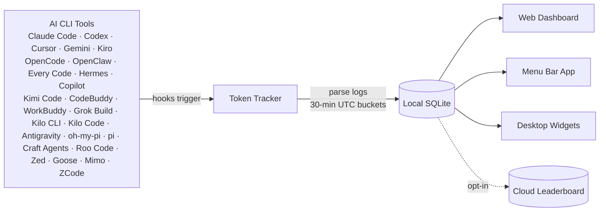

 <div align="center">

# Token Tracker

**English** · [简体中文](./README.zh-CN.md) · [日本語](./README.ja.md) · [한국어](./README.ko.md) · [Deutsch](./README.de.md)

### Know exactly what you're spending on AI — across every CLI

Auto-collect token counts from **25 AI coding tools**, aggregate them locally, and see real cost trends in a beautiful dashboard. No cloud account, no API keys, no setup — just one command.

[](https://www.npmjs.com/package/tokentracker-cli)
[](https://www.npmjs.com/package/tokentracker-cli)
[](https://github.com/mm7894215/homebrew-tokentracker)
[](https://opensource.org/licenses/MIT)
[](https://www.npmjs.com/package/tokentracker-cli)
[](https://github.com/mm7894215/TokenTracker/releases/latest)
[](https://github.com/mm7894215/TokenTracker/releases/latest)
[](https://github.com/mm7894215/TokenTracker/stargazers)
[](https://github.com/ruanyf/weekly/blob/master/docs/issue-393.md)
[](https://github.com/mm7894215/TokenTracker)

<br/>

<video src="https://github.com/user-attachments/assets/5e709422-5af8-4e4c-8109-f5bb711eb3f8" controls muted playsinline poster="https://raw.githubusercontent.com/mm7894215/tokentracker/main/docs/screenshots/dashboard-dark.png" width="820">
  
</video>

<video src="https://github.com/user-attachments/assets/3275979d-bbed-4639-83e2-8b7d83bed6af" controls muted playsinline poster="https://raw.githubusercontent.com/mm7894215/tokentracker/main/docs/screenshots/dashboard-light.png" width="820"></video>

<br/><br/>

⭐ **If TokenTracker saves you time, please [star it on GitHub](https://github.com/mm7894215/TokenTracker) — it helps other developers find it.**

<br/>

[](https://ko-fi.com/M4M11XSNWD)

</div>

---

## ⚡ Quick Start

> **Requirements**: Node.js **20+** (CLI runs on macOS / Linux / Windows; native desktop app ships for both macOS (menu bar) and Windows (system tray). Cursor token reading uses the system `sqlite3` CLI when available and falls back to `node:sqlite` on supported Node releases).

```bash
npx tokentracker-cli
```

That's it. First run installs hooks, syncs your data, and opens the dashboard at `http://localhost:7680`.

**What you get in 30 seconds:**
- 📊 A local dashboard at `localhost:7680` with usage trends, model breakdown, cost analysis
- 🔌 Auto-detected hooks for every supported AI tool you have installed
- 🏠 100% local — no account, no API keys, no network calls (except optional leaderboard)
- 🧩 *Optional:* a Skills tab that browses 250+ public skills and syncs them across Claude · Codex · Grok · Antigravity · Gemini · OpenCode · Hermes

> **Want a native desktop app?**
> - **macOS** — [Download `TokenTrackerBar.dmg`](https://github.com/mm7894215/TokenTracker/releases/latest/download/TokenTrackerBar.dmg) → drag to Applications. Menu bar status icon, desktop widgets, and the dashboard in a WKWebView.
> - **Windows** — [Download `TokenTracker-Setup.exe`](https://github.com/mm7894215/TokenTracker/releases/latest/download/TokenTracker-Setup.exe) → run the per-user installer (no admin needed). System-tray app with the dashboard in WebView2. Portable zip also on the [releases page](https://github.com/mm7894215/TokenTracker/releases/latest).

Install globally for shorter commands:

```bash
npm i -g tokentracker-cli

tokentracker              # Open the dashboard
tokentracker sync         # Manual sync
tokentracker status       # Check hook status
tokentracker status --json     # Machine-readable summary (pipe to jq, ingest from AI agents)
tokentracker status --light    # Plain ASCII table (CI / SSH, no spinner)
tokentracker doctor       # Health check
```

### 🍺 Homebrew (macOS)

Prefer `brew`? Install directly — no extra tap step needed:

```bash
# macOS menu bar app (DMG)
brew install --cask mm7894215/tokentracker/tokentracker

# CLI only
brew install mm7894215/tokentracker/tokentracker
```

Upgrade with `brew upgrade --cask mm7894215/tokentracker/tokentracker`. The tap auto-bumps within an hour of every new release.

---


## ✨ Features

- 🔌 **25 AI tools out of the box** — Claude Code, Codex CLI, Cursor, Gemini CLI, Antigravity, Kiro, OpenCode, OpenClaw, Every Code, Hermes Agent, GitHub Copilot, Kimi Code, CodeBuddy, WorkBuddy, Grok Build, oh-my-pi, pi, Craft Agents, Kilo CLI, Kilo Code, Roo Code, Zed Agent, Goose, Mimo Code, ZCode
- 🏠 **100% local** — Token data never leaves your machine. No account, no API keys.
- 🚀 **Zero config** — Hooks auto-install on first run. From zero to dashboard in 30 seconds.
- 📊 **Beautiful dashboard** — Usage trends, cost breakdowns by model, GitHub-style activity heatmap, project attribution
- 🖥️ **Native desktop app** — macOS menu bar (+ widgets) and Windows system tray, each with an embedded server and the dashboard in a native webview
- 🎨 **4 desktop widgets** — Pin Usage / Activity Heatmap / Top Models / Usage Limits to your desktop
- 📈 **Real-time rate limit tracking** — Claude / Codex / Cursor / Gemini / Kiro / Copilot / Antigravity quota windows with reset countdowns
- 💰 **Cost engine** — 2,200+ models priced via [LiteLLM](https://github.com/BerriAI/litellm/blob/main/model_prices_and_context_window.json) (auto-refreshed daily) + curated overrides for niche tools (Kiro, Cursor Composer, Kimi, CodeBuddy hy3); 24h disk cache + bundled offline snapshot mean accurate USD without an internet connection. Models without published vendor pricing (e.g. Tencent hy3-preview) are tracked by tokens but show $0 cost until the vendor publishes a rate.
- 🌐 **Optional leaderboard** — Compare with developers worldwide; drag-to-reorder columns to focus on the providers you care about (opt-in, sign in to participate)
- 🔄 **Cross-device account view** — Opt in to cloud sync and the dashboard merges your usage across every machine you work on (laptop + desktop + server) into one combined view — totals, trends, heatmap and model breakdown all device-aggregated (opt-in, sign in; the default local-only experience stays instant and offline)
- 🧩 **Optional Skills tab** — browse 250+ public skills from `anthropics/skills`, `ComposioHQ/awesome-claude-skills`, `skills.sh` and any GitHub repo you add; sync them across Claude / Codex / Grok / Antigravity / Gemini / OpenCode / Hermes with named targets and one-click Undo
- 🔒 **Privacy-first** — Only token counts and timestamps. Never prompts, responses, or file contents.

---

## 🖼️ Showcase

<table>
<tr>
<td width="50%">

**Dashboard** — usage trends, model breakdown, cost analysis


</td>
<td width="50%">

**Desktop Widgets** — pin usage to your desktop


</td>
</tr>
<tr>
<td width="50%">

**Menu Bar App** — animated Clawd companion + native panels


</td>
<td width="50%">

**Global Leaderboard** — compare with developers worldwide


</td>
</tr>
<tr>
<td colspan="2">

**Skills Manager** — browse 250+ public skills from GitHub & `skills.sh`, install once, sync to Claude / Codex / Grok / Antigravity / Gemini / OpenCode / Hermes. Per-target toggles, one-click Undo, no manual file copying.


</td>
</tr>
<tr>
<td colspan="2">

**Desktop Pet** — a pixel companion that floats on your desktop and reacts to your real token burn: it codes when you code, celebrates streaks, and sleeps when you rest. Import community pets from [codex-pets.net](https://codex-pets.net) with a link or a `.codex-pet.zip` — V2 pets even turn their head to follow your cursor in 16 directions. macOS, Windows, and web.


</td>
</tr>
</table>

---

## 🔌 Supported AI Tools

| Tool | Detection | Method |
|---|---|---|
| **Claude Code** | ✅ Auto | SessionEnd hook in `settings.json` |
| **Codex CLI** | ✅ Auto | TOML notify hook in `config.toml` |
| **Cursor** | ✅ Auto | API + SQLite auth token |
| **Kiro** | ✅ Auto | SQLite + JSONL hybrid |
| **Gemini CLI** | ✅ Auto | SessionEnd hook |
| **OpenCode** | ✅ Auto | Plugin system + SQLite |
| **OpenClaw** | ✅ Auto | Session plugin |
| **Every Code** | ✅ Auto | TOML notify hook |
| **Hermes Agent** | ✅ Auto | SQLite sessions table (`~/.hermes/state.db`) |
| **GitHub Copilot App** | ✅ Auto | Passive session-summary reader (`~/.copilot/data.db`, or `COPILOT_HOME/data.db`) |
| **GitHub Copilot CLI / Chat extension** | ✅ Auto | OpenTelemetry file exporter (`COPILOT_OTEL_FILE_EXPORTER_PATH`) |
| **Kimi Code** | ✅ Auto | Passive `wire.jsonl` reader (`~/.kimi/sessions/**/wire.jsonl`) |
| **oh-my-pi (Pi Coding Agent)** | ✅ Auto | Passive reader (`~/.omp/agent/sessions/**/*.jsonl`) |
| **CodeBuddy** (Tencent) | ✅ Auto | SessionEnd hook in `~/.codebuddy/settings.json` (Claude-Code fork) |
| **WorkBuddy** (Tencent) | ✅ Auto | SessionEnd hook in `~/.workbuddy/settings.json` (Claude-Code fork) + passive `projects/**/*.jsonl` scan |
| **Grok Build** (xAI) | ✅ Auto | SessionEnd hook + passive `updates.jsonl` / `signals.json` scan (`~/.grok/sessions/**/`) |
| **Kilo CLI** (kilo.ai) | ✅ Auto | Passive SQLite reader (`~/.local/share/kilo/kilo.db`, OpenCode-fork schema) |
| **Kilo Code** (VS Code extension) | ✅ Auto | Passive `ui_messages.json` reader (Cursor/Code/CodeBuddy/Windsurf globalStorage) |
| **Antigravity** | ✅ Auto | Passive transcript reader (`~/.gemini/{antigravity,antigravity-ide,antigravity-cli}/brain/**/transcript.jsonl`) |
| **pi** (`@mariozechner/pi-coding-agent`) | ✅ Auto | Passive reader (`~/.pi/agent/sessions/**/*.jsonl`) |
| **Craft Agents** | ✅ Auto | Passive session reader (`~/.craft-agent` + workspace session logs) |
| **Roo Code** (VS Code extension) | ✅ Auto | Passive `ui_messages.json` reader (`rooveterinaryinc.roo-cline`) |
| **Zed Agent** | ✅ Auto | Passive SQLite reader (`threads.db`, all providers — hosted `zed.dev` + bring-your-own) |
| **Goose** (Block) | ✅ Auto | Passive SQLite reader (`sessions.db`, cumulative deltas) |
| **Mimo Code** (mimocode) | ✅ Auto | Passive SQLite reader (`~/.local/share/mimocode/mimocode.db`, OpenCode-fork schema; counts only mimo-native turns — mirrored Claude/claude-mem history is excluded) |
| **ZCode** (Z.ai) | ✅ Auto | Passive SQLite reader (`~/.zcode/cli/db/db.sqlite`, OpenCode-fork schema; counts only Z.ai/BigModel GLM turns — bundled Claude/Codex/Gemini sub-agents are excluded) |

> **Do I need to install any plugin or hook manually?** No. `tokentracker` (or `tokentracker init`) handles everything on first run:
> - **Hook-based** tools (Claude Code, Codex, Gemini, Every Code, **CodeBuddy**, **WorkBuddy**, **Grok Build**) — we write a SessionEnd hook or TOML notify entry into the tool's own config.
> - **Plugin-based** tools (OpenCode, **OpenClaw**) — plugins ship inside the npm package. OpenClaw's session plugin lives at `~/.tokentracker/tracker/openclaw-plugin/openclaw-session-sync/`; we link and enable it via OpenClaw's own CLI, then set `hooks.allowConversationAccess=true` so OpenClaw permits the session-finished event that triggers sync. No download, no drag-and-drop.
> - **Passive readers** (Cursor, Kiro, Hermes, Kimi Code, Copilot, **Grok Build**, **oh-my-pi**, **pi**, **Craft Agents**, **Kilo CLI**, **Kilo Code**, **Roo Code**, **Antigravity**, **Zed Agent**, **Goose**, **Mimo Code**, **ZCode**) — nothing is installed into those tools. We only read files they already produce (SQLite DB, JSONL, OTEL export, session logs). Copilot App usage is read from `~/.copilot/data.db` `sessions.total_*` token summaries only and feeds the existing `copilot` aggregate statistics (totals, trends, model breakdown, cost). Copilot CLI / Chat extension usage remains OTEL-based; both surfaces keep separate sync cursors to avoid duplicate counting.
> - **Grok Build estimate** — current local telemetry exposes cumulative `updates.jsonl` `totalTokens`, but not a stable prompt/output/cache split; `signals.json` remains a fallback with `contextTokensUsed` snapshots. TokenTracker estimates Grok cost until per-call usage details are available.
>
> Run `tokentracker status` anytime to verify every integration's state. If something shows `skipped`, the `detail` column explains why (e.g. tool CLI not on `PATH`, config unreadable).
>
> Deeper dives: [OpenClaw integration & troubleshooting](docs/openclaw-integration.md).

Missing your tool? [Open an issue](https://github.com/mm7894215/TokenTracker/issues/new) — adding new providers is usually one parser file away.

---

## 🆚 Why TokenTracker? <a id="ccusage-alternative"></a>

> **Looking for a ccusage alternative with a GUI?** TokenTracker covers 25 tools (not just Claude Code), adds a native macOS menu bar app + desktop widgets, and de-duplicates token records correctly across providers — so your numbers match the providers' own billing.

|                          | **TokenTracker** | ccusage     | Cursor stats |
|--------------------------|:---:|:---:|:---:|
| **AI tools supported**   | **25**           | 1 (Claude)  | 1 (Cursor)   |
| **Local-first, no account** | ✅            | ✅           | ❌            |
| **Native desktop app**   | ✅ macOS + Windows | ❌           | ❌            |
| **Desktop widgets**      | ✅ 4 widgets      | ❌           | ❌            |
| **Rate-limit tracking**  | ✅ 7 providers    | ❌           | Cursor only  |
| **Accurate multi-provider dedup** | ✅      | ❌ ¹         | —            |

<sub>¹ `reqId`-based deduplication over-counts providers that omit a request ID (DeepSeek / Kimi / MiniMax / Claude sub-agents) by 1.6–3.7×. TokenTracker dedups on a composite key, so totals match each provider's own billing dashboard.</sub>

---

## 🏗️ How It Works



1. AI CLI tools generate logs during normal use
2. Lightweight hooks detect changes and trigger sync (Cursor uses API instead of hooks)
3. Token counts parsed locally — never any prompt or response content
4. Aggregated into 30-minute UTC buckets
5. Dashboard, menu bar app, and widgets all read from the same local snapshot

---

## 🛡️ Privacy

| Protection | Description |
|---|---|
| **No content upload** | Only token counts and timestamps. Never prompts, responses, or file contents. |
| **Local-only by default** | All data stays on your machine. The leaderboard is fully opt-in. |
| **Auditable** | Open source. Read [`src/lib/rollout.js`](src/lib/rollout.js) — only numbers and timestamps. |
| **Anonymous usage stats only** | Two things phone home, both anonymous: (1) at most one daily heartbeat — a one-way hash of the machine id, app version, OS platform, and app shell (cli/mac/win); (2) anonymous dashboard pageview/feature events (PostHog — autocapture and session recording disabled, browser Do-Not-Track respected). Never token counts, model names, prompts, or paths. Audit [`src/lib/telemetry.js`](src/lib/telemetry.js) and [`dashboard/src/lib/analytics.js`](dashboard/src/lib/analytics.js); one switch disables both on your machine: `TOKENTRACKER_NO_TELEMETRY=1` (or `DO_NOT_TRACK=1`). |

---

## 📦 Configuration

Most users never need this — defaults are sensible. For advanced setups:

| Variable | Description | Default |
|---|---|---|
| `TOKENTRACKER_DEBUG` | Enable debug output (`1` to enable) | — |
| `TOKENTRACKER_NO_TELEMETRY` | Disable all anonymous telemetry — daily heartbeat and dashboard analytics (`1` to disable; the `DO_NOT_TRACK` standard is also respected) | — |
| `TOKENTRACKER_HTTP_TIMEOUT_MS` | HTTP timeout in milliseconds | `20000` |
| `TOKENTRACKER_WSL_MODE` | WSL install resolution behavior on Windows (for aggregating native and WSL installations). `wsl-first` (prefer WSL), `native-first`, `wsl-only`, `native-only`, `both` (aggregate both installs) | `wsl-first` |
| `CODEX_HOME` | Override Codex CLI directory | `~/.codex` |
| `GEMINI_HOME` | Override Gemini CLI directory | `~/.gemini` |
| `TOKENTRACKER_GROK_HOME` | Override Grok Build directory for the Grok integration and Skills Manager | `~/.grok` |
| `GROK_HOME` | Legacy Grok Build directory override, used when `TOKENTRACKER_GROK_HOME` is unset | `~/.grok` |
| `TOKENTRACKER_ANTIGRAVITY_HOME` | Force a single Antigravity Skills directory (auto-detects `~/.gemini/antigravity` + `~/.gemini/antigravity-ide` otherwise) | auto |

### 🐧 Windows Subsystem for Linux (WSL) Auto-Discovery

If you run AI coding agents inside WSL on Windows, TokenTracker can auto-discover and aggregate metrics from both native Windows and WSL installations. 

Configure this behavior using the `TOKENTRACKER_WSL_MODE` environment variable:
* `both` (Recommended): Scans and aggregates metrics from both native Windows and WSL.
* `wsl-first` (Default): Checks WSL first; if found, uses WSL metrics, otherwise falls back to Windows.
* `native-first`: Checks native Windows first; if found, uses Windows metrics, otherwise falls back to WSL.
* `wsl-only`: Scans WSL environment only.
* `native-only`: Scans native Windows environment only.

Supported providers for WSL auto-discovery:
* **File-list & Active CLIs:** Every Code, Kimi (legacy & Code), Gemini CLI, Antigravity, OpenCode, Codex CLI, CodeBuddy, WorkBuddy, oh-my-pi, pi, Grok Build, GitHub Copilot, Roo Code, Craft, Kilo Code.
* **SQLite-based DBs:** Hermes, Zed Agent, Goose, Droid, Kilo CLI, Mimo Code, ZCode.

---

## 🛠️ Development

```bash
git clone https://github.com/mm7894215/TokenTracker.git
cd TokenTracker
npm install

# Build dashboard + run CLI
cd dashboard && npm install && npm run build && cd ..
node bin/tracker.js

# Tests
npm test
```

### Building the macOS App

```bash
cd TokenTrackerBar
npm run dashboard:build              # Build the dashboard bundle
./scripts/bundle-node.sh             # Bundle Node.js + tokentracker source
xcodegen generate                    # Generate the Xcode project
ruby scripts/patch-pbxproj-icon.rb   # Patch in the Icon Composer asset
xcodebuild -scheme TokenTrackerBar -configuration Release clean build
./scripts/create-dmg.sh              # Package the .app into a DMG
```

Requires **Xcode 16+** and [XcodeGen](https://github.com/yonaskolb/XcodeGen).

---

## 🔧 Troubleshooting

### CLI

<details>
<summary><b>"engines.node" or unsupported version error</b></summary>

<br/>

TokenTracker requires **Node 20+**. Check your version:

```bash
node --version
```

If lower, upgrade via [nvm](https://github.com/nvm-sh/nvm), [fnm](https://github.com/Schniz/fnm), or your package manager (`brew upgrade node`, `apt install nodejs`).

</details>

<details>
<summary><b>Port 7680 already in use</b></summary>

<br/>

The dashboard server picks the next free port automatically (`7681`, `7682`, ...) when `7680` is taken. The actual port is logged on startup. If you want to force a specific port:

```bash
PORT=7700 tokentracker serve
```

To find what's holding `7680`:

```bash
lsof -i :7680
```

**WSL2 note**: on Windows hosts the Delivery Optimization service (`DoSvc`) listens on `7680`, and under NAT networking the conflict is invisible from inside WSL — the server starts fine but the Windows browser reaches `DoSvc` instead. TokenTracker therefore defaults to `7681` when running under WSL (logged on startup).

</details>

<details>
<summary><b>A provider isn't being detected</b></summary>

<br/>

Check the integration status:

```bash
tokentracker status
```

Then run the doctor for a deeper health check:

```bash
tokentracker doctor
```

If a provider shows as not configured even though you use it, try `tokentracker activate-if-needed` to re-run hook detection. If still missing, [open an issue](https://github.com/mm7894215/TokenTracker/issues/new) with the `doctor` output attached.

</details>

<details>
<summary><b>How to uninstall hooks and remove all config</b></summary>

<br/>

```bash
tokentracker uninstall
```

This removes every hook TokenTracker installed across all detected AI tools, plus the local config and data. Safe to re-run.

</details>

### macOS App

<details>
<summary><b>"TokenTrackerBar can't be opened" — unidentified developer</b></summary>

<br/>

TokenTrackerBar is **ad-hoc signed** (not notarized with an Apple Developer ID — that requires a paid developer account). Gatekeeper blocks it on first launch.

1. Open **System Settings → Privacy & Security**
2. Scroll to the **Security** section — you'll see *"TokenTrackerBar was blocked to protect your Mac."*
3. Click **Open Anyway**
4. Confirm with **Open** in the follow-up dialog (you'll need to authenticate)

You only need to do this once. Older macOS alternative: right-click the app in Finder → **Open** → **Open** in the confirmation dialog.

</details>

<details>
<summary><b>"TokenTrackerBar is damaged and can't be opened"</b></summary>

<br/>

This is Gatekeeper reacting to the `com.apple.quarantine` attribute macOS attaches to every downloaded file — not an actual problem. Clear it once with:

```bash
xattr -cr /Applications/TokenTrackerBar.app
```

After that the app opens normally.

</details>

<details>
<summary><b>"TokenTrackerBar wants to access data from other apps"</b></summary>

<br/>

This is required for the **Cursor** and **Kiro** integrations. They store auth tokens / usage data inside their own `~/Library/Application Support/` folders, which macOS protects with the App Management permission.

- ✅ Click **Allow** if you use Cursor or Kiro
- ❌ Click **Don't Allow** if you don't — those providers will be silently skipped, everything else keeps working

Once granted, the permission is remembered. Note that ad-hoc signed builds re-prompt after each upgrade because each build has a new signing identity.

</details>

---

## 🪪 README Badges

Show off your token usage on your GitHub profile or project README.

To get `YOUR_USER_ID`:
1. Run `tokentracker`, open the dashboard, and sign in to the leaderboard.
2. Go to **Settings → Account**.
3. Use the **User ID** shown there. On headless machines, `tokentracker device-login` also writes the same `user_id` to `~/.tokentracker/tracker/config.json`.

Then drop one of these in:

```markdown
[](https://github.com/mm7894215/TokenTracker)
[](https://github.com/mm7894215/TokenTracker)
[](https://github.com/mm7894215/TokenTracker)
```

> The link target defaults to the TokenTracker repo so every click helps other developers discover the tool. Swap it for your leaderboard profile, personal site, or `https://www.tokentracker.cc` if you'd rather route clicks elsewhere.

Renders shields.io-compatible badges with your current totals (60s cache):

| Param | Values | Default |
|---|---|---|
| `metric` | `tokens` / `cost` / `rank` | `tokens` |
| `period` | `week` / `month` / `total` | `total` |
| `style` | `flat` / `flat-square` | `flat` |
| `label` | any short string | metric name |
| `color` | hex, e.g. `ff6b35` | brand green |

> **Privacy**: badges only resolve for profiles where leaderboard sharing is **on** (`Settings → Account → Public profile`). Private profiles get a "private" placeholder.

---

## ⭐ Star History

<a href="https://star-history.com/#mm7894215/TokenTracker&Date">
  
</a>

---

## 🤝 Contributing & Support

- **Bugs / feature requests**: [open an issue](https://github.com/mm7894215/TokenTracker/issues/new)
- **Security**: see [SECURITY.md](SECURITY.md) — please don't open public issues for security reports
- **Pull requests**: see [CONTRIBUTING.md](CONTRIBUTING.md) for setup, tests, and how to add a new AI tool integration
- **Questions / showcase**: [GitHub Discussions](https://github.com/mm7894215/TokenTracker/discussions)

## 🙏 Credits

The Clawd character design belongs to Anthropic. This is a community project with no official affiliation with Anthropic.

## 🔗 Friendly Links

- [LINUX DO](https://linux.do) — a developer community we like

## License

[MIT](LICENSE)

---

<div align="center">

**Token Tracker** — Quantify your AI output.

<a href="https://www.tokentracker.cc">tokentracker.cc</a>  ·  <a href="https://www.npmjs.com/package/tokentracker-cli">npm</a>  ·  <a href="https://github.com/mm7894215/TokenTracker">GitHub</a>

</div>
