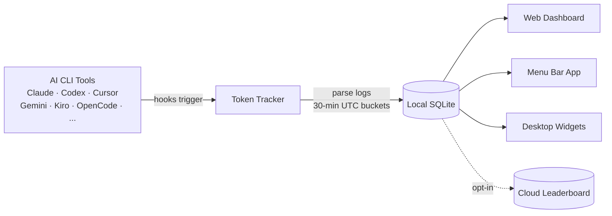

<div align="center">

# Token Tracker

### Know exactly what you're spending on AI — across every CLI

Auto-collect token counts from **8 AI coding tools**, aggregate them locally, and see real cost trends in a beautiful dashboard. No cloud account, no API keys, no setup — just one command.

[](https://www.npmjs.com/package/tokentracker-cli)
[](https://www.npmjs.com/package/tokentracker-cli)
[](https://opensource.org/licenses/MIT)
[](https://www.apple.com/macos/)
[](https://github.com/mm7894215/TokenTracker/stargazers)

<br/>


<br/><br/>

⭐ **If TokenTracker saves you time, please [star it on GitHub](https://github.com/mm7894215/TokenTracker) — it helps other developers find it.**

</div>

---

## ⚡ Quick Start

```bash
npx tokentracker-cli
```

That's it. First run installs hooks, syncs your data, and opens the dashboard at `http://localhost:7680`.

> **Want a native macOS menu bar app?** [Download `TokenTrackerBar.dmg`](https://github.com/mm7894215/TokenTracker/releases/latest) → drag to Applications. Includes desktop widgets, menu bar status icon, and the same dashboard in a WKWebView.

Install globally for shorter commands:

```bash
npm i -g tokentracker-cli

tokentracker              # Open the dashboard
tokentracker sync         # Manual sync
tokentracker status       # Check hook status
tokentracker doctor       # Health check
```

---

## ✨ Features

- 🔌 **8 AI tools out of the box** — Claude Code, Codex CLI, Cursor, Gemini CLI, Kiro, OpenCode, OpenClaw, Every Code
- 🏠 **100% local** — Token data never leaves your machine. No account, no API keys.
- 🚀 **Zero config** — Hooks auto-install on first run. From zero to dashboard in 30 seconds.
- 📊 **Beautiful dashboard** — Usage trends, cost breakdowns by model, GitHub-style activity heatmap, project attribution
- 🖥️ **Native macOS app** — Menu bar status icon, embedded server, WKWebView dashboard
- 🎨 **4 desktop widgets** — Pin Usage / Activity Heatmap / Top Models / Usage Limits to your desktop
- 📈 **Real-time rate limit tracking** — Claude / Codex / Cursor / Gemini / Kiro / Antigravity quota windows with reset countdowns
- 💰 **Cost engine** — 70+ model pricing tables, accurate USD breakdowns
- 🌐 **Optional leaderboard** — Compare with developers worldwide (opt-in, sign in to participate)
- 🔒 **Privacy-first** — Only token counts and timestamps. Never prompts, responses, or file contents.

---

## 🖼️ Showcase

<table>
<tr>
<td width="50%">

**Dashboard** — usage trends, model breakdown, cost analysis


</td>
<td width="50%">

**Desktop Widgets** — pin usage to your desktop


</td>
</tr>
<tr>
<td width="50%">

**Menu Bar App** — animated Clawd companion + native panels


</td>
<td width="50%">

**Global Leaderboard** — compare with developers worldwide


</td>
</tr>
</table>

---

## 🔌 Supported AI Tools

| Tool | Detection | Method |
|---|---|---|
| **Claude Code** | ✅ Auto | SessionEnd hook in `settings.json` |
| **Codex CLI** | ✅ Auto | TOML notify hook in `config.toml` |
| **Cursor** | ✅ Auto | API + SQLite auth token |
| **Kiro** | ✅ Auto | SQLite + JSONL hybrid |
| **Gemini CLI** | ✅ Auto | SessionEnd hook |
| **OpenCode** | ✅ Auto | Plugin system + SQLite |
| **OpenClaw** | ✅ Auto | Session plugin |
| **Every Code** | ✅ Auto | TOML notify hook |

Missing your tool? [Open an issue](https://github.com/mm7894215/TokenTracker/issues/new) — adding new providers is usually one parser file away.

---

## 🆚 Why TokenTracker?

|                              | **TokenTracker**           | ccusage      | Cursor stats   | Native CLI dashboards |
|------------------------------|----------------------------|--------------|----------------|------------------------|
| **AI tools supported**       | **8** (multi-tool)         | 1 (Claude)   | 1 (Cursor)     | 1 each                 |
| **Local-first, no account**  | ✅                          | ✅            | ❌ requires login | varies              |
| **Native macOS menu bar**    | ✅                          | ❌            | ❌              | ❌                      |
| **Desktop widgets**          | ✅ 4 widgets                | ❌            | ❌              | ❌                      |
| **Rate-limit tracking**      | ✅ 6 providers              | ❌            | Cursor only    | ❌                      |
| **Cost breakdown**           | ✅ 70+ models               | Claude only  | Cursor only    | varies                 |
| **Activity heatmap**         | ✅                          | ❌            | ❌              | ❌                      |
| **Project attribution**      | ✅                          | ❌            | ❌              | ❌                      |
| **License**                  | MIT (free)                 | MIT (free)   | proprietary    | varies                 |

---

## 🏗️ How It Works



1. AI CLI tools generate logs during normal use
2. Lightweight hooks detect changes and trigger sync (Cursor uses API instead of hooks)
3. Token counts parsed locally — never any prompt or response content
4. Aggregated into 30-minute UTC buckets
5. Dashboard, menu bar app, and widgets all read from the same local snapshot

---

## 🛡️ Privacy

| Protection | Description |
|---|---|
| **No content upload** | Only token counts and timestamps. Never prompts, responses, or file contents. |
| **Local-only by default** | All data stays on your machine. The leaderboard is fully opt-in. |
| **Auditable** | Open source. Read [`src/lib/rollout.js`](src/lib/rollout.js) — only numbers and timestamps. |
| **No telemetry** | No analytics, no crash reporting, no phone-home. |

---

## 📦 Configuration

Most users never need this — defaults are sensible. For advanced setups:

| Variable | Description | Default |
|---|---|---|
| `TOKENTRACKER_DEBUG` | Enable debug output (`1` to enable) | — |
| `TOKENTRACKER_HTTP_TIMEOUT_MS` | HTTP timeout in milliseconds | `20000` |
| `CODEX_HOME` | Override Codex CLI directory | `~/.codex` |
| `GEMINI_HOME` | Override Gemini CLI directory | `~/.gemini` |

---

## 🛠️ Development

```bash
git clone https://github.com/mm7894215/TokenTracker.git
cd TokenTracker
npm install

# Build dashboard + run CLI
cd dashboard && npm install && npm run build && cd ..
node bin/tracker.js

# Tests
npm test
```

### Building the macOS App

```bash
cd TokenTrackerBar
npm run dashboard:build              # Build the dashboard bundle
./scripts/bundle-node.sh             # Bundle Node.js + tokentracker source
xcodegen generate                    # Generate the Xcode project
ruby scripts/patch-pbxproj-icon.rb   # Patch in the Icon Composer asset
xcodebuild -scheme TokenTrackerBar -configuration Release clean build
./scripts/create-dmg.sh              # Package the .app into a DMG
```

Requires **Xcode 16+** and [XcodeGen](https://github.com/yonaskolb/XcodeGen).

---

## 🔧 Troubleshooting

<details>
<summary><b>macOS: "TokenTrackerBar can't be opened" — unidentified developer</b></summary>

<br/>

TokenTrackerBar is **ad-hoc signed** (not notarized with an Apple Developer ID — that requires a paid developer account). Gatekeeper blocks it on first launch with a friendly-looking but unhelpful dialog.

1. Open **System Settings → Privacy & Security**
2. Scroll to the **Security** section — you'll see *"TokenTrackerBar was blocked to protect your Mac."*
3. Click **Open Anyway**
4. Confirm with **Open** in the follow-up dialog (you'll need to authenticate)

You only need to do this once. Older macOS alternative: right-click the app in Finder → **Open** → **Open** in the confirmation dialog.

</details>

<details>
<summary><b>macOS: "TokenTrackerBar is damaged and can't be opened"</b></summary>

<br/>

This is Gatekeeper reacting to the `com.apple.quarantine` attribute macOS attaches to every downloaded file — not an actual problem. Clear it once with:

```bash
xattr -cr /Applications/TokenTrackerBar.app
```

After that the app opens normally. You only need to do this once per download.

</details>

<details>
<summary><b>macOS privacy prompts on first launch</b></summary>

<br/>

You may see one or both of these prompts the first time you run TokenTrackerBar:

- **"TokenTrackerBar wants to access data from other apps"** — This is required for the **Cursor** and **Kiro** integrations. They store auth tokens / usage data inside their own `~/Library/Application Support/` folders, which macOS protects with the App Management permission. Click **Allow** to grant. If you don't use Cursor or Kiro, click **Don't Allow** — those providers will be silently skipped, all others continue working.

Once granted, the permission is remembered. Note that ad-hoc signed builds re-prompt after each upgrade because each build has a new signing identity.

</details>

---

## ⭐ Star History

<a href="https://star-history.com/#mm7894215/TokenTracker&Date">
  
</a>

---

## 🙏 Credits

Clawd pixel art inspired by [Clawd-on-Desk](https://github.com/Angel2518975237/Clawd-on-Desk) by [@marciogranzotto](https://github.com/marciogranzotto). The Clawd character design belongs to Anthropic. This is a community project with no official affiliation with Anthropic.

## License

[MIT](LICENSE)

---

<div align="center">

**Token Tracker** — Quantify your AI output.

<a href="https://token.rynn.me">token.rynn.me</a>  ·  <a href="https://www.npmjs.com/package/tokentracker-cli">npm</a>  ·  <a href="https://github.com/mm7894215/TokenTracker">GitHub</a>

</div>
