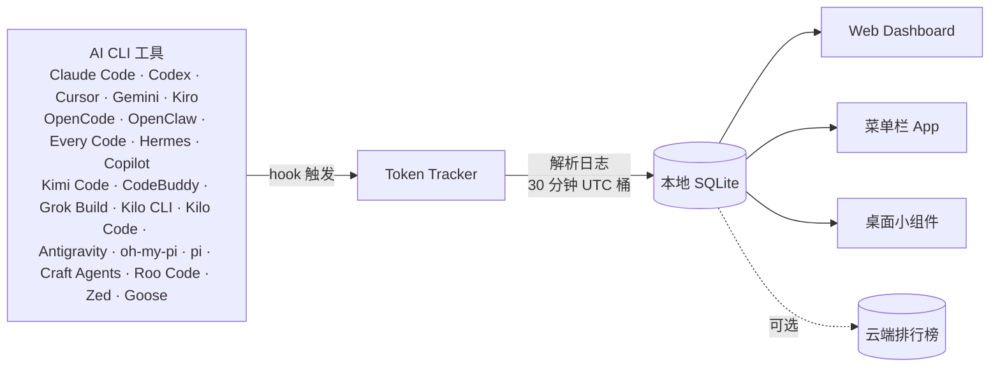

 <div align="center">

# Token Tracker

[English](./README.md) · **简体中文** · [日本語](./README.ja.md) · [한국어](./README.ko.md)

### 跨所有 CLI，看清你到底在 AI 上花了多少钱

自动采集 **22 款 AI 编码工具** 的 token 用量，全程本地聚合，用一套漂亮的 Dashboard 看真实成本与趋势。不需要云账号、不需要 API Key、不需要任何配置 —— 一条命令搞定。

[](https://www.npmjs.com/package/tokentracker-cli)
[](https://www.npmjs.com/package/tokentracker-cli)
[](https://github.com/mm7894215/homebrew-tokentracker)
[](https://opensource.org/licenses/MIT)
[](https://www.apple.com/macos/)
[](https://github.com/mm7894215/TokenTracker/stargazers)
[](https://github.com/ruanyf/weekly/blob/master/docs/issue-393.md)
[](https://github.com/mm7894215/TokenTracker)

<br/>

<video src="https://github.com/user-attachments/assets/3275979d-bbed-4639-83e2-8b7d83bed6af" controls muted playsinline poster="https://raw.githubusercontent.com/mm7894215/tokentracker/main/docs/screenshots/dashboard-dark.png" width="820">
  
</video>

<br/><br/>

⭐ **如果 TokenTracker 帮你省了时间，欢迎 [在 GitHub 上 Star](https://github.com/mm7894215/TokenTracker) —— 可以让更多开发者发现它。**

<br/>

[](https://ko-fi.com/M4M11XSNWD)

</div>

---

## ⚡ 快速开始

> **环境要求**：Node.js **20+**（CLI 支持 macOS / Linux / Windows；原生桌面 App 提供 macOS 菜单栏版与 Windows 系统托盘版；Cursor 的 SQLite 读取仅限 macOS）。

```bash
npx tokentracker-cli
```

就这一行。首次运行会自动安装 hook、同步数据，并在 `http://localhost:7680` 打开 Dashboard。

**30 秒能看到什么：**
- 📊 本地 Dashboard（`localhost:7680`）—— 用量趋势、模型明细、成本分析
- 🔌 自动识别并挂接你电脑上所有已安装的 AI 工具
- 🏠 100% 本地运行 —— 无账号、无 API Key、无网络请求（排行榜是可选的）
- 🧩 *可选：* Skills 面板——浏览 250+ 公开 skill，并在 Claude · Codex · Grok · Antigravity · Gemini · OpenCode · Hermes 之间同步

> **想要原生桌面 App？**
> - **macOS** —— [下载 `TokenTrackerBar.dmg`](https://github.com/mm7894215/TokenTracker/releases/latest/download/TokenTrackerBar.dmg) → 拖入「应用程序」即可。包含桌面小组件、菜单栏状态图标，以及同一套 Dashboard（跑在 WKWebView 里）。
> - **Windows** —— [下载 `TokenTracker-Setup.exe`](https://github.com/mm7894215/TokenTracker/releases/latest/download/TokenTracker-Setup.exe) → 运行免管理员的单用户安装包即可。系统托盘 App，Dashboard 跑在 WebView2 里。便携版 zip 见[发布页](https://github.com/mm7894215/TokenTracker/releases/latest)。

全局安装可以少敲字：

```bash
npm i -g tokentracker-cli

tokentracker              # 打开 Dashboard
tokentracker sync         # 手动同步
tokentracker status       # 查看 hook 挂接状态
tokentracker status --json   # 机器可读 JSON（pipe 到 jq、给 AI agent 喂数据）
tokentracker status --light  # 纯 ASCII 表（CI / SSH 用，无 spinner）
tokentracker doctor       # 健康检查
```

### 🍺 Homebrew（macOS）

用惯 `brew` 的话可以直接装，无需额外 `tap`：

```bash
# macOS 菜单栏 App（DMG）
brew install --cask mm7894215/tokentracker/tokentracker

# 只装 CLI
brew install mm7894215/tokentracker/tokentracker
```

升级：`brew upgrade --cask mm7894215/tokentracker/tokentracker`。每次新版本发布后，tap 会在一小时内自动跟上。

---


## ✨ 特性

- 🔌 **开箱即用支持 22 款 AI 工具** —— Claude Code、Codex CLI、Cursor、Gemini CLI、Kiro、OpenCode、OpenClaw、Every Code、Hermes Agent、GitHub Copilot、Kimi Code、CodeBuddy、Grok Build、oh-my-pi、pi、Craft Agents、Kilo CLI、Kilo Code、Roo Code、Antigravity、Zed Agent、Goose
- 🏠 **100% 本地** —— Token 数据绝不离开你的机器。无账号、无 API Key
- 🚀 **零配置** —— 首次运行自动安装所有 hook。30 秒从零到 Dashboard
- 📊 **漂亮的 Dashboard** —— 用量趋势、按模型的成本分解、GitHub 风格活跃度热力图、按项目归因
- 🖥️ **原生桌面 App** —— macOS 菜单栏（含桌面小组件）与 Windows 系统托盘，各自内嵌服务 + 原生 WebView Dashboard
- 🎨 **4 种桌面小组件** —— 用量 / 热力图 / 热门模型 / 使用限额 直接钉桌面
- 📈 **实时限额追踪** —— Claude / Codex / Cursor / Gemini / Kiro / Copilot / Antigravity 的配额窗口与重置倒计时
- 💰 **成本引擎** —— 内置 70+ 模型定价表，精确到 USD
- 🌐 **可选排行榜** —— 与全球开发者对比；列可拖拽排序，聚焦你关心的 provider（需登录参与）
- 🧩 **可选 Skills 面板** —— 浏览 250+ 公开 skill（来自 `anthropics/skills`、`ComposioHQ/awesome-claude-skills`、`skills.sh` 以及你自己添加的任何 GitHub 仓库），在 Claude / Codex / Grok / Antigravity / Gemini / OpenCode / Hermes 之间同步，目标 Agent 文字可见、可单独管理、一键撤销
- 🔒 **隐私优先** —— 只记录 token 数量与时间戳。**绝不**收集 prompt、回复、文件内容

---

## 🖼️ 截图

<table>
<tr>
<td width="50%">

**Dashboard** —— 用量趋势、模型分布、成本分析


</td>
<td width="50%">

**桌面小组件** —— 把用量钉在桌面


</td>
</tr>
<tr>
<td width="50%">

**菜单栏 App** —— 带动画的 Clawd 小伙伴 + 原生面板


</td>
<td width="50%">

**全球排行榜** —— 和世界各地开发者比一比


</td>
</tr>
<tr>
<td colspan="2">

**Skills 管理器** —— 浏览 250+ 公开 skill（GitHub 仓库 & `skills.sh`），一次安装，同步到 Claude / Codex / Grok / Antigravity / Gemini / OpenCode / Hermes。每个 Agent 单独开关，一键撤销，再也不用手动复制文件夹。


</td>
</tr>
</table>

---

## 🔌 已支持的 AI 工具

| 工具 | 识别方式 | 接入方式 |
|---|---|---|
| **Claude Code** | ✅ 自动 | 写入 `settings.json` 的 SessionEnd hook |
| **Codex CLI** | ✅ 自动 | 写入 `config.toml` 的 TOML notify hook |
| **Cursor** | ✅ 自动 | API + SQLite 中的 auth token |
| **Kiro** | ✅ 自动 | SQLite + JSONL 混合读取 |
| **Gemini CLI** | ✅ 自动 | SessionEnd hook |
| **Antigravity** | ✅ 自动 | 被动读取 transcript.jsonl（`~/.gemini/{antigravity,antigravity-ide,antigravity-cli}/brain/**/transcript.jsonl`） |
| **OpenCode** | ✅ 自动 | 插件系统 + SQLite |
| **OpenClaw** | ✅ 自动 | Session 插件 |
| **Every Code** | ✅ 自动 | TOML notify hook |
| **Hermes Agent** | ✅ 自动 | SQLite sessions 表（`~/.hermes/state.db`） |
| **GitHub Copilot** | ✅ 自动 | OpenTelemetry 文件导出（`COPILOT_OTEL_FILE_EXPORTER_PATH`） |
| **Kimi Code** | ✅ 自动 | 被动读取 `wire.jsonl`（`~/.kimi/sessions/**/wire.jsonl`） |
| **oh-my-pi (Pi Coding Agent)** | ✅ 自动 | 被动读取（`~/.omp/agent/sessions/**/*.jsonl`） |
| **CodeBuddy** (腾讯) | ✅ 自动 | 写入 `~/.codebuddy/settings.json` 的 SessionEnd hook（Claude-Code fork） |
| **Grok Build** (xAI) | ✅ 自动 | SessionEnd hook + 被动扫描 `updates.jsonl` / `signals.json`（`~/.grok/sessions/**/`） |
| **Kilo CLI** (kilo.ai) | ✅ 自动 | 被动读取 SQLite（`~/.local/share/kilo/kilo.db`，OpenCode-fork schema） |
| **Kilo Code** (VS Code 插件) | ✅ 自动 | 被动读取 `ui_messages.json`（Cursor / VS Code / CodeBuddy / Windsurf 的 globalStorage） |
| **pi** (`@mariozechner/pi-coding-agent`) | ✅ 自动 | 被动读取（`~/.pi/agent/sessions/**/*.jsonl`） |
| **Craft Agents** | ✅ 自动 | 被动读取 session（`~/.craft-agent` + workspace session logs） |
| **Roo Code** (VS Code 扩展) | ✅ 自动 | 被动读取 `ui_messages.json`（`rooveterinaryinc.roo-cline`） |
| **Zed Agent** | ✅ 自动 | 被动 SQLite 读取（`threads.db`，仅统计托管的 `zed.dev` 模型） |
| **Goose** (Block) | ✅ 自动 | 被动 SQLite 读取（`sessions.db`，累计量 delta） |

> **需要手动装什么插件 / hook 吗？** 不需要。`tokentracker`（或 `tokentracker init`）第一次跑的时候会全部搞定：
> - **基于 hook 的工具**（Claude Code、Codex、Gemini、Every Code、**CodeBuddy**、**Grok Build**）—— 我们把 SessionEnd hook 或 TOML notify 条目写入它们自己的配置文件
> - **基于插件的工具**（OpenCode、**OpenClaw**）—— 插件随 npm 包一起分发（`~/.tokentracker/app/openclaw-plugin/`），通过对应工具自己的 CLI 挂接（`openclaw plugins install --link …` + `enable`）。无需下载、无需拖拽
> - **被动读取类**（Cursor、Kiro、Hermes、Kimi Code、Copilot、**Grok Build**、**oh-my-pi**、**pi**、**Craft Agents**、**Kilo CLI**、**Kilo Code**、**Roo Code**、**Antigravity**、**Zed Agent**、**Goose**）—— 完全不往它们里面塞东西，只读取它们自己产生的文件（SQLite DB、JSONL、OTEL 导出、会话轨迹日志）
> - **Grok Build 估算说明** —— Grok 当前本地遥测提供 `updates.jsonl` 里的累计 `totalTokens`，但还没有稳定的输入/输出/cache 拆分；`signals.json` 仍作为 `contextTokensUsed` 快照兜底。所以在 Grok 提供按调用粒度的用量明细之前，TokenTracker 对 Grok 成本仍是估算值
>
> 任何时候都可以用 `tokentracker status` 查看每个集成的状态。如果显示 `skipped`，`detail` 列会解释原因（例如某工具 CLI 不在 `PATH` 上、config 不可读等）。
>
> 更深入的资料：[OpenClaw 集成与排障](docs/openclaw-integration.md)。

工具没在列表里？[提个 Issue](https://github.com/mm7894215/TokenTracker/issues/new) —— 加一个新 provider 通常只是加一个 parser 文件的事。

---

## 🆚 为什么选 TokenTracker？

|                          | **TokenTracker** | ccusage     | Cursor 自带统计 |
|--------------------------|:---:|:---:|:---:|
| **支持的 AI 工具数**     | **22**           | 1（Claude）  | 1（Cursor）   |
| **本地优先，无需账号**   | ✅               | ✅           | ❌            |
| **原生桌面 App**         | ✅ macOS + Windows | ❌          | ❌            |
| **桌面小组件**           | ✅ 4 个小组件    | ❌           | ❌            |
| **限额追踪**             | ✅ 7 家 provider | ❌           | 只支持 Cursor |

---

## 🏗️ 工作原理



1. 正常使用 AI CLI 工具时，它们会写 log
2. 轻量级 hook 感知日志变动并触发同步（Cursor 走 API，不走 hook）
3. token 数量在本地解析 —— **绝不**读取 prompt 或回复内容
4. 聚合成 30 分钟一格的 UTC 桶
5. Dashboard、菜单栏 App 和桌面小组件都读取同一份本地快照

---

## 🛡️ 隐私

| 承诺 | 说明 |
|---|---|
| **不上传内容** | 只记录 token 数量和时间戳。**绝不**记录 prompt、回复或文件内容 |
| **默认纯本地** | 所有数据保留在你的机器上。排行榜是完全 opt-in |
| **可审计** | 代码开源。[`src/lib/rollout.js`](src/lib/rollout.js) 里只有数字和时间戳 |
| **零埋点** | 无分析、无崩溃上报、无任何 phone-home |

---

## 📦 配置项

99% 的用户不需要改。进阶玩家可以用以下环境变量：

| 变量 | 说明 | 默认值 |
|---|---|---|
| `TOKENTRACKER_DEBUG` | 打开 debug 日志（`1` 表示打开） | — |
| `TOKENTRACKER_HTTP_TIMEOUT_MS` | HTTP 超时时间（毫秒） | `20000` |
| `CODEX_HOME` | 覆盖 Codex CLI 目录 | `~/.codex` |
| `GEMINI_HOME` | 覆盖 Gemini CLI 目录 | `~/.gemini` |
| `TOKENTRACKER_GROK_HOME` | 覆盖 Grok Build 目录，供 Grok 集成和 Skills Manager 使用 | `~/.grok` |
| `GROK_HOME` | 旧版 Grok Build 目录覆盖变量；未设置 `TOKENTRACKER_GROK_HOME` 时使用 | `~/.grok` |
| `TOKENTRACKER_ANTIGRAVITY_HOME` | 强制指定 Antigravity Skills 目录（不设时自动检测 `~/.gemini/antigravity` 和 `~/.gemini/antigravity-ide`，同步会同时写入两者） | 自动 |

---

## 🛠️ 本地开发

```bash
git clone https://github.com/mm7894215/TokenTracker.git
cd TokenTracker
npm install

# 构建 Dashboard + 跑 CLI
cd dashboard && npm install && npm run build && cd ..
node bin/tracker.js

# 跑测试
npm test
```

### 构建 macOS App

```bash
cd TokenTrackerBar
npm run dashboard:build              # 构建 Dashboard 前端
./scripts/bundle-node.sh             # 打包 Node.js + tokentracker 源码
xcodegen generate                    # 生成 Xcode 工程
ruby scripts/patch-pbxproj-icon.rb   # 补一下 Icon Composer 资源
xcodebuild -scheme TokenTrackerBar -configuration Release clean build
./scripts/create-dmg.sh              # 打 DMG
```

需要 **Xcode 16+** 和 [XcodeGen](https://github.com/yonaskolb/XcodeGen)。

---

## 🔧 排障

### CLI

<details>
<summary><b>报 "engines.node" 或版本不兼容错误</b></summary>

<br/>

TokenTracker 需要 **Node 20+**。先看看你装的是哪个版本：

```bash
node --version
```

如果低于 20，用 [nvm](https://github.com/nvm-sh/nvm)、[fnm](https://github.com/Schniz/fnm) 或系统包管理器升级（`brew upgrade node`、`apt install nodejs` 等）。

</details>

<details>
<summary><b>端口 7680 被占用</b></summary>

<br/>

被占用时 Dashboard 会自动顺延（`7681`、`7682` …），实际端口在启动日志里会打出来。如果你想强制指定端口：

```bash
PORT=7700 tokentracker serve
```

查谁占着 `7680`：

```bash
lsof -i :7680
```

</details>

<details>
<summary><b>某个 AI 工具没被检测到</b></summary>

<br/>

先看集成状态：

```bash
tokentracker status
```

然后跑一个深度健康检查：

```bash
tokentracker doctor
```

如果你明明在用某个工具却显示未配置，跑一下 `tokentracker activate-if-needed` 重新探测。还不行的话 [提个 Issue](https://github.com/mm7894215/TokenTracker/issues/new)，把 `doctor` 的输出贴上。

</details>

<details>
<summary><b>怎么完全卸载所有 hook 和配置</b></summary>

<br/>

```bash
tokentracker uninstall
```

这会把 TokenTracker 在所有 AI 工具里写入的 hook 全部清掉，同时删除本地配置和数据。可以安全重复执行。

</details>

### macOS App

<details>
<summary><b>"无法打开 TokenTrackerBar，因为它来自身份不明的开发者"</b></summary>

<br/>

TokenTrackerBar 使用 **ad-hoc 签名**（没有用 Apple Developer ID 做公证，因为那需要付费账号）。Gatekeeper 会在首次启动时拦下。

1. 打开 **系统设置 → 隐私与安全性**
2. 滑到 **安全性** 区域 —— 你会看到提示「TokenTrackerBar 已被阻止以保护 Mac」
3. 点击 **仍要打开**
4. 在后续对话框中再点一次 **打开**（需要输入密码）

只需要做一次。老版本 macOS 上的替代做法：在访达里右键 App → **打开** → 确认对话框里再点 **打开**。

</details>

<details>
<summary><b>"TokenTrackerBar 已损坏，无法打开"</b></summary>

<br/>

其实不是真坏了 —— 这是 Gatekeeper 对 macOS 给下载文件自动贴的 `com.apple.quarantine` 属性做出的反应。清除一次即可：

```bash
xattr -cr /Applications/TokenTrackerBar.app
```

之后就能正常打开了。

</details>

<details>
<summary><b>"TokenTrackerBar 想访问其他 App 的数据"</b></summary>

<br/>

这个权限是 **Cursor** 和 **Kiro** 集成需要的。它们把 auth token / 用量数据存在自己的 `~/Library/Application Support/` 目录下，而 macOS 用 App Management 权限保护这类访问。

- ✅ 用 Cursor / Kiro：点 **允许**
- ❌ 不用：点 **不允许**，这两个 provider 会被静默跳过，其他一切正常

授权一次即可记住。注意 ad-hoc 签名的版本每次升级后签名身份会变，所以每次升级都会重新弹一次。

</details>

---

## 🪪 README 徽章

把你的 token 用量秀到 GitHub Profile 或项目 README 上。

获取 `你的_USER_ID`：
1. 运行 `tokentracker`，打开 Dashboard，并登录排行榜。
2. 进入 **设置 → 账号**。
3. 使用页面里的 **User ID**。如果是 headless/SSH 机器，`tokentracker device-login` 也会把同一个 `user_id` 写到 `~/.tokentracker/tracker/config.json`。

然后贴一段：

```markdown
[](https://github.com/mm7894215/TokenTracker)
[](https://github.com/mm7894215/TokenTracker)
[](https://github.com/mm7894215/TokenTracker)
```

> 链接默认指向 TokenTracker 仓库，每次点击都能帮其他开发者发现 TokenTracker。如果你想让点击跳到你自己的 leaderboard profile、个人主页或 `https://www.tokentracker.cc`，改 URL 即可。

输出 shields.io 兼容的徽章 SVG，含你当前的累计数据（60 秒缓存）：

| 参数 | 取值 | 默认 |
|---|---|---|
| `metric` | `tokens` / `cost` / `rank` | `tokens` |
| `period` | `week` / `month` / `total` | `total` |
| `style` | `flat` / `flat-square` | `flat` |
| `label` | 任意短文本 | 指标名 |
| `color` | hex，例如 `ff6b35` | 品牌绿 |

> **隐私**：徽章仅对开启了排行榜公开（**设置 → 账号 → 公开 Profile**）的用户生效；未公开的用户会返回 "private" 占位徽章。

---

## ⭐ Star 历史

<a href="https://star-history.com/#mm7894215/TokenTracker&Date">
  
</a>

---

## 🤝 贡献与支持

- **Bug / 功能建议**：[提个 Issue](https://github.com/mm7894215/TokenTracker/issues/new)
- **安全问题**：见 [SECURITY.md](SECURITY.md) —— 请不要在公开 Issue 里提交安全报告
- **Pull Request**：见 [CONTRIBUTING.md](CONTRIBUTING.md)，里面有开发环境搭建、测试流程和新增 AI 工具集成的指南
- **提问 / 展示作品**：[GitHub Discussions](https://github.com/mm7894215/TokenTracker/discussions)

## 🙏 致谢

Clawd 角色设计归属 Anthropic。本项目是社区项目，和 Anthropic 无官方隶属关系。

## License

[MIT](LICENSE)

---

<div align="center">

**Token Tracker** —— 把你的 AI 产出量化。

<a href="https://www.tokentracker.cc">tokentracker.cc</a>  ·  <a href="https://www.npmjs.com/package/tokentracker-cli">npm</a>  ·  <a href="https://github.com/mm7894215/TokenTracker">GitHub</a>

</div>
